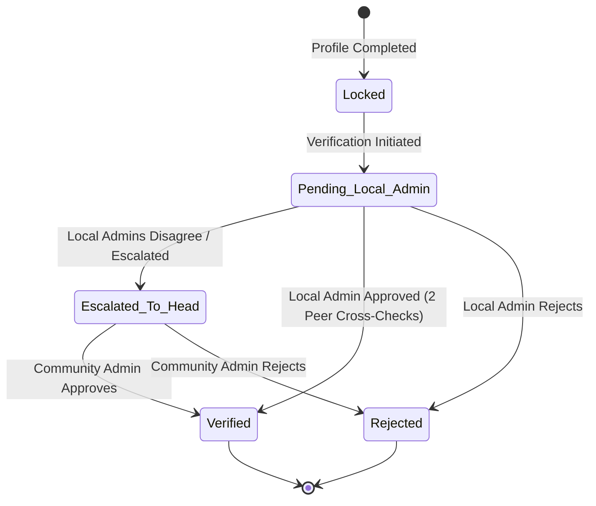
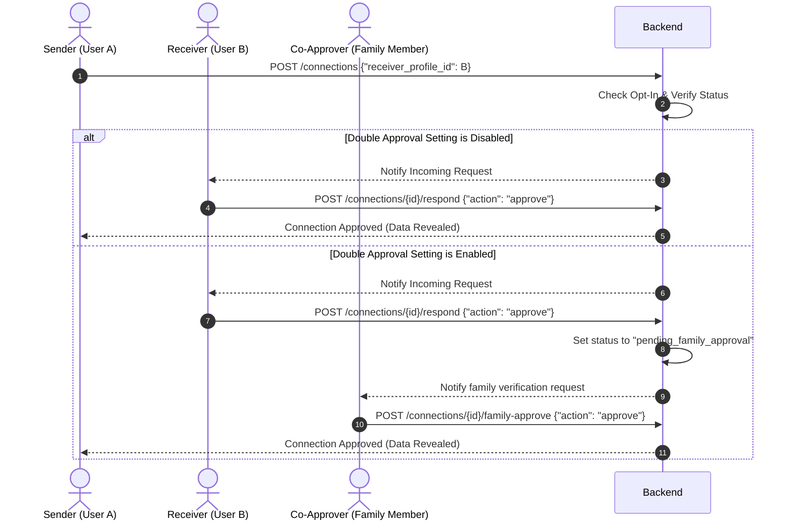

# API Documentation - CommunityConnect Platform

**Version:** 1.1.0 (Current Implementation)  
**Base URL:** `/api/v1`  
**Protocol:** HTTP (HTTPS in production)  
**Format:** JSON  
**CORS:** `allow_origins=["*"]`, `allow_methods=["*"]`, `allow_headers=["*"]` (development mode)

> [!NOTE]
> This document reflects the **current implemented API** as of v1.1.0. Some sections from the original PRD design (Family Units, OTP via SMS, Registry Search) are planned for future versions and are marked accordingly.

---

## 1. API Design Principles

### 1.1 RESTful Architecture
The API is designed around REST principles. Resources are identified by plural nouns in URLs (e.g., `/profiles`, `/family-units`), and standard HTTP methods define the operations:
*   `GET`: Retrieve a resource or list of resources.
*   `POST`: Create a new resource or perform a specialized command.
*   `PUT`: Update an existing resource (full replacement or major modification).
*   `PATCH`: Apply partial modifications to a resource.
*   `DELETE`: Deactivate or archive a resource (soft deletion).

### 1.2 Versioning
All routes are prefixed with `/api/v1/` to ensure backwards compatibility as the platform evolves. Any breaking changes will lead to the introduction of `/api/v2/`.

### 1.3 Consistency in Error Responses
All error responses use a standard JSON envelope with an `error` code/slug and a human-readable `message` to simplify client-side handling.

#### Validation Error Schema (HTTP 422 Unprocessable Entity)
When request payload validation fails (e.g., invalid phone format), the API returns a structured validation error payload:
```json
{
  "detail": [
    {
      "loc": ["body", "phone_number"],
      "msg": "value is not a valid phone number",
      "type": "value_error.any_str"
    }
  ]
}
```

#### Standard Error Schema (HTTP 400, 401, 403, 404, 500)
```json
{
  "error": "ERROR_CODE_SLUG",
  "message": "A human-readable explanation of what went wrong."
}
```

### 1.4 HTTP Status Codes

| Code | Status | Description |
| :--- | :--- | :--- |
| **200** | OK | Request succeeded. Returns requested data. |
| **201** | Created | Resource successfully created. Returns created resource. |
| **204** | No Content | Request succeeded, but there is no response body content (e.g., successful logout). |
| **400** | Bad Request | Request is malformed or violates business logic (e.g., opting in to matrimony while married). |
| **401** | Unauthorized | Authentication is missing or invalid. |
| **403** | Forbidden | User is authenticated but lacks permission for the resource. |
| **404** | Not Found | The requested resource does not exist. |
| **409** | Conflict | The resource state conflicts with request (e.g., profile already verified or duplicate registration). |
| **422** | Unprocessable Entity | Input data failed schema validation checks. |
| **500** | Internal Error | Server encountered an unexpected error. |

---

## 2. Security, Authentication & Access Control

### 2.1 Email-Based Authentication & JWT

Authentication uses **email + password** with email OTP verification for new registrations. Upon login, the system returns:
*   An **Access Token** (JWT, configurable expiry — default 30 mins) sent in the `Authorization: Bearer <token>` header.
*   A **Refresh Token** (long-lived JWT, default 7 days) used to retrieve a new Access Token via `/auth/refresh`.

> [!NOTE]
> **Email OTP for Registration:** During registration (`POST /auth/register/email`), a 6-digit OTP is sent to the provided email. The user must verify it via `POST /auth/verify/email` within the expiry window before the account is activated.

> [!NOTE]
> **Mock mode:** Set `EMAIL_PROVIDER=mock` to skip real email sending in development. OTP codes are printed to the terminal.

### 2.2 Role-Based Access Control (RBAC)
The system enforces authorization levels mapped to user roles:

| Role Name | Authority Scope |
| :--- | :--- |
| **Community Admin** | Full read/write access. Can resolve verification escalations, manage regions, access dashboard, and delete user accounts. |
| **Local Admin** | Scoped read/write access to assigned geographic region. Can approve/reject verification requests and cross-verify peer Local Admins. |
| **Verified Adult** | Full control of own profile. Can opt-in to Matrimony, configure co-approver, manage connection requests. Can act as a guardian (co-approver) for others. |
| **Minor (Under 18)** | Read-only access to their own profile. No matrimonial features, no connection requests, and no self-edits. |
| **Unverified User** | Restricted access. Can sign up, complete their own profile, and submit for verification. |

### 2.3 Profile Visibility Tiers
To protect user privacy, the profile schema is partitioned into two visibility tiers:

*   **Public Tier:** Visible to all verified community members.
    *   *Fields:* `id`, `full_name`, `age` (calculated from DOB), `gender`, `profile_photo_url`.
*   **Restricted Tier:** Visible only to the profile owner (`Self`), their `Family Head`, `Local Admins`, `Community Admins`, or matrimonial partners with an **approved Connection Request**.
    *   *Fields:* `date_of_birth` (exact), `phone_number`, `address`, `occupation`, `family_unit_id`, `relationship_to_head`.

### 2.4 Edit Conflict Resolution: Self-Edit Priority
Both the `Self` user (if adult) and their `Family Head` have write access to the user's profile. In case of conflicting edits, the **Self-edit takes priority**. The backend enforces this by rejecting updates from a Family Head if the field has been modified directly by the Self-user within a protected timestamp window, or by letting the owner's write override all previous edits.

---

## 3. Workflows & State Machines

### 3.1 Verification Flow
A user begins as `Unverified` and locked out. The verification process follows a multi-party state machine.



### 3.2 Matrimonial Connection Request Flow
Matrimonial profiles operate on a private-account authorization model. Connection requests can follow a single-stage or dual-stage approval process.



---

## 4. Endpoints Reference

### 4.1 Authentication Endpoints

#### 4.1.1 Register with Email (Step 1 — Send OTP)
*   **Method:** `POST`
*   **Path:** `/api/v1/auth/register/email`
*   **Description:** Step 1 of registration. User provides email and password. The system sends a 6-digit OTP to the email address.
*   **Auth Required:** None (Public)
*   **Request Body (JSON):**
    ```json
    {
      "email": "user@example.com",
      "password": "securepassword"
    }
    ```
*   **Response Body (JSON):**
    ```json
    {
      "message": "OTP sent to your email. Please verify within 10 minutes."
    }
    ```
*   **Status Codes:**
    *   `200 OK`: OTP sent successfully.
    *   `400 Bad Request`: Email already registered.
    *   `422 Unprocessable Entity`: Invalid email format.

#### 4.1.2 Verify OTP & Complete Registration (Step 2)
*   **Method:** `POST`
*   **Path:** `/api/v1/auth/verify/email`
*   **Description:** Step 2 of registration. User provides email, OTP code, and password to complete account creation. Returns a JWT access+refresh token pair.
*   **Auth Required:** None (Public)
*   **Request Body (JSON):**
    ```json
    {
      "email": "user@example.com",
      "code": "482910",
      "password": "securepassword"
    }
    ```
*   **Response Body (JSON):**
    ```json
    {
      "access_token": "eyJhbGciOiJIUzI1NiIsInR5cCI6IkpXVCJ9...",
      "refresh_token": "eyJhbGciOiJIUzI1NiIsInR5cCI6IkpXVCJ9...",
      "token_type": "bearer"
    }
    ```
*   **Status Codes:**
    *   `200 OK`: Registration complete, tokens issued.
    *   `400 Bad Request`: Invalid or expired OTP code.
    *   `422 Unprocessable Entity`: Validation failure.

#### 4.1.3 Login
*   **Method:** `POST`
*   **Path:** `/api/v1/auth/login`
*   **Description:** Authenticates a registered user with email and password. Returns JWT tokens.
*   **Auth Required:** None (Public)
*   **Request Body (JSON):**
    ```json
    {
      "email": "user@example.com",
      "password": "securepassword"
    }
    ```
*   **Response Body (JSON):**
    ```json
    {
      "access_token": "eyJhbGciOiJIUzI1NiIsInR5cCI6IkpXVCJ9...",
      "refresh_token": "eyJhbGciOiJIUzI1NiIsInR5cCI6IkpXVCJ9...",
      "token_type": "bearer"
    }
    ```
*   **Status Codes:**
    *   `200 OK`: Login successful.
    *   `401 Unauthorized`: Invalid email or password.
    *   `403 Forbidden`: Account is deactivated.

#### 4.1.4 Refresh Token
*   **Method:** `POST`
*   **Path:** `/api/v1/auth/refresh`
*   **Description:** Exchanges a valid refresh token for a new access token.
*   **Auth Required:** None (Requires valid refresh token in body)
*   **Request Body (JSON):**
    ```json
    {
      "refresh_token": "eyJhbGciOiJIUzI1NiIsInR5cCI6IkpXVCJ9..."
    }
    ```
*   **Response Body (JSON):**
    ```json
    {
      "access_token": "eyJhbGciOiJIUzI1NiIsInR5cCI6IkpXVCJ9...",
      "token_type": "bearer"
    }
    ```
*   **Status Codes:**
    *   `200 OK`: New access token issued.
    *   `401 Unauthorized`: Invalid or expired refresh token.

#### 4.1.5 Logout
*   **Method:** `POST`
*   **Path:** `/api/v1/auth/logout`
*   **Description:** Invalidates the session.
*   **Auth Required:** Bearer Token required
*   **Status Codes:**
    *   `200 OK`: Successfully logged out.
    *   `401 Unauthorized`: Missing or invalid token.

---

## 4.2 Profile Endpoints

> [!NOTE]
> Actual implemented prefix: `/api/v1/profiles`

#### 4.2.1 Onboard Profile
*   **Method:** `POST`
*   **Path:** `/api/v1/profiles/onboard`
*   **Description:** Submits the user's full profile during the onboarding step. Triggers admin verification workflow automatically.
*   **Auth Required:** `unverified` role
*   **Request Body (JSON):**
    ```json
    {
      "full_name": "Siddharth Gowda",
      "date_of_birth": "1995-04-12",
      "gender": "Male",
      "marital_status": "Unmarried",
      "phone_number": "+919876543210",
      "address": "45, 2nd Main, Indiranagar, Bengaluru, KA",
      "occupation": "Software Engineer",
      "profile_photo_url": "https://storage.googleapis.com/comm-photos/profile_104.jpg",
      "family_unit_id": 12,
      "relationship_to_head": "Self"
    }
    ```
*   **Response Body (JSON):**
    ```json
    {
      "id": 402,
      "full_name": "Siddharth Gowda",
      "date_of_birth": "1995-04-12",
      "age": 31,
      "gender": "Male",
      "marital_status": "Unmarried",
      "phone_number": "+919876543210",
      "address": "45, 2nd Main, Indiranagar, Bengaluru, KA",
      "occupation": "Software Engineer",
      "profile_photo_url": "https://storage.googleapis.com/comm-photos/profile_104.jpg",
      "family_unit_id": 12,
      "relationship_to_head": "Self",
      "is_verified": false,
      "is_memorial": false,
      "created_at": "2026-06-30T18:30:00Z",
      "updated_at": "2026-06-30T18:30:00Z"
    }
    ```
*   **Query Parameters:** None
*   **Status Codes:**
    *   `201 Created`: Profile successfully created.
    *   `400 Bad Request`: Input payload validation or business logic error.
    *   `409 Conflict`: A profile with this phone number already exists.

#### 4.2.2 Get My Profile
*   **Method:** `GET`
*   **Path:** `/api/v1/profiles/me`
*   **Description:** Retrieves the logged-in user's full profile. Includes matrimony data, social links, and a list of `wards` (people who set the caller as their co-approver).
*   **Auth Required:** Any authenticated user
*   **Response Body (JSON):**
    ```json
    {
      "id": "uuid",
      "full_name": "Siddharth Gowda",
      "username": "sidgowda",
      "date_of_birth": "1995-04-12",
      "gender": "male",
      "marital_status": "single",
      "occupation": "Software Engineer",
      "address": "Bengaluru, KA",
      "profile_photo_url": "https://...",
      "role": "verified_adult",
      "matrimony": {
        "opted_in": true,
        "double_approval_required": false,
        "family_co_approver_profile_id": null,
        "family_co_approver_approved": false
      },
      "wards": [
        {
          "profile_id": "uuid",
          "full_name": "Priya Hegde",
          "username": "priyahegde",
          "gender": "female",
          "approved": true
        }
      ]
    }
    ```
*   **Status Codes:**
    *   `200 OK`: Success.
    *   `401 Unauthorized`: Missing or invalid token.

#### 4.2.3 Update Username
*   **Method:** `PUT`
*   **Path:** `/api/v1/profiles/me/username`
*   **Description:** Sets or updates the user's unique `@username` handle. Used for co-approver lookup.
*   **Auth Required:** `verified_adult` | `local_admin` | `community_admin`
*   **Request Body (JSON):**
    ```json
    { "username": "sidgowda" }
    ```
*   **Status Codes:**
    *   `200 OK`: Username updated.
    *   `409 Conflict`: Username already taken.

#### 4.2.4 Lookup Profile by Username
*   **Method:** `GET`
*   **Path:** `/api/v1/profiles/by-username/{username}`
*   **Description:** Looks up a profile by their `@username`. Used by the Matrimony edit page to find and assign a co-approver.
*   **Auth Required:** Any authenticated user
*   **Status Codes:**
    *   `200 OK`: Profile found.
    *   `404 Not Found`: No user with that username.

#### 4.2.5 Update Social Links
*   **Method:** `PUT`
*   **Path:** `/api/v1/profiles/me/social`
*   **Description:** Updates social media profile links (LinkedIn, Instagram, Facebook, Twitter/X).
*   **Auth Required:** `verified_adult` | `local_admin` | `community_admin`
*   **Request Body (JSON):**
    ```json
    {
      "linkedin_url": "https://linkedin.com/in/sidgowda",
      "instagram_url": null,
      "facebook_url": null,
      "twitter_url": null
    }
    ```
*   **Status Codes:**
    *   `200 OK`: Social links updated.

#### 4.2.3 Update My Profile
*   **Method:** `PUT`
*   **Path:** `/api/v1/profiles/me`
*   **Description:** Updates the logged-in user's profile. This update is protected by **Self-Edit Priority**; modifications made directly here override edits requested by a Family Head.
*   **Auth Required:** `Self` (Verified Adult), `Family Head`, `Local Admin`, `Community Admin`
*   **Request Body (JSON):**
    ```json
    {
      "full_name": "Siddharth Gowda",
      "marital_status": "Unmarried",
      "address": "90, 4th Cross, HSR Layout, Bengaluru, KA",
      "occupation": "Senior Software Engineer",
      "profile_photo_url": "https://storage.googleapis.com/comm-photos/profile_104_v2.jpg"
    }
    ```
*   **Response Body (JSON):**
    ```json
    {
      "id": 402,
      "full_name": "Siddharth Gowda",
      "date_of_birth": "1995-04-12",
      "age": 31,
      "gender": "Male",
      "marital_status": "Unmarried",
      "phone_number": "+919876543210",
      "address": "90, 4th Cross, HSR Layout, Bengaluru, KA",
      "occupation": "Senior Software Engineer",
      "profile_photo_url": "https://storage.googleapis.com/comm-photos/profile_104_v2.jpg",
      "family_unit_id": 12,
      "relationship_to_head": "Self",
      "is_verified": true,
      "is_memorial": false,
      "updated_at": "2026-06-30T18:35:00Z"
    }
    ```
*   **Query Parameters:** None
*   **Status Codes:**
    *   `200 OK`: Profile successfully updated.
    *   `400 Bad Request`: Validation failure.

#### 4.2.4 Get Profile by ID
*   **Method:** `GET`
*   **Path:** `/api/v1/profiles/{id}`
*   **Description:** Retrieves a profile by its ID. Enforces tiered visibility based on user access. Returns only Public fields unless the requester is the owner, family head, admin, or has an approved matrimonial connection.
*   **Auth Required:** Verified User
*   **Request Body:** None
*   **Response Body (JSON - Requester has access to Public Tier only):**
    ```json
    {
      "id": 501,
      "full_name": "Ananya Hegde",
      "age": 28,
      "gender": "Female",
      "profile_photo_url": "https://storage.googleapis.com/comm-photos/profile_501.jpg",
      "is_verified": true,
      "is_memorial": false,
      "_visibility_tier": "public"
    }
    ```
*   **Response Body (JSON - Requester has access to Restricted Tier due to Family relation or Approved Connection):**
    ```json
    {
      "id": 501,
      "full_name": "Ananya Hegde",
      "date_of_birth": "1998-09-24",
      "age": 27,
      "gender": "Female",
      "marital_status": "Unmarried",
      "phone_number": "+919988776655",
      "address": "Apartment 4B, Prestige Heights, Bengaluru, KA",
      "occupation": "Architect",
      "profile_photo_url": "https://storage.googleapis.com/comm-photos/profile_501.jpg",
      "family_unit_id": 15,
      "relationship_to_head": "Daughter",
      "is_verified": true,
      "is_memorial": false,
      "_visibility_tier": "restricted"
    }
    ```
*   **Query Parameters:** None
*   **Status Codes:**
    *   `200 OK`: Profile details retrieved.
    *   `401 Unauthorized`: Unauthenticated requester.
    *   `403 Forbidden`: Requester is not verified (pre-verification lock).
    *   `404 Not Found`: Profile not found.

#### 4.2.5 Update Profile by ID
*   **Method:** `PUT`
*   **Path:** `/api/v1/profiles/{id}`
*   **Description:** Allows updates to a specific profile. Write access restricted to the profile owner (`Self`), the `Family Head`, or a `Community Admin`. If the profile owner has modified a field directly, a Family Head cannot override it (Self-edit priority logic applies).
*   **Auth Required:** `Self`, `Family Head`, or `Community Admin`
*   **Request Body (JSON):**
    ```json
    {
      "full_name": "Ananya Hegde",
      "marital_status": "Unmarried",
      "address": "Apartment 5C, Prestige Heights, Bengaluru, KA",
      "occupation": "Senior Architect"
    }
    ```
*   **Response Body (JSON):**
    ```json
    {
      "id": 501,
      "full_name": "Ananya Hegde",
      "date_of_birth": "1998-09-24",
      "age": 27,
      "gender": "Female",
      "marital_status": "Unmarried",
      "phone_number": "+919988776655",
      "address": "Apartment 5C, Prestige Heights, Bengaluru, KA",
      "occupation": "Senior Architect",
      "profile_photo_url": "https://storage.googleapis.com/comm-photos/profile_501.jpg",
      "family_unit_id": 15,
      "relationship_to_head": "Daughter",
      "is_verified": true,
      "is_memorial": false,
      "updated_at": "2026-06-30T18:36:00Z"
    }
    ```
*   **Query Parameters:** None
*   **Status Codes:**
    *   `200 OK`: Profile updated.
    *   `403 Forbidden`: Requester is not authorized to edit this profile, or is a Family Head attempting to override a prioritized Self-edited field.
    *   `404 Not Found`: Profile not found.

---

## 4.3 Family Unit Endpoints

#### 4.3.1 Create Family Unit
*   **Method:** `POST`
*   **Path:** `/api/v1/family-units`
*   **Description:** Instantiates a new Family Unit. The creator is designated as the `Family Head` by default unless specified otherwise.
*   **Auth Required:** Verified Adult (`Self`, `Local Admin`, `Community Admin`)
*   **Request Body (JSON):**
    ```json
    {
      "family_name": "Gowda Household",
      "head_profile_id": 402,
      "ancestral_origin_village": "Hassan"
    }
    ```
*   **Response Body (JSON):**
    ```json
    {
      "id": 12,
      "family_name": "Gowda Household",
      "head_profile_id": 402,
      "ancestral_origin_village": "Hassan",
      "members_count": 1,
      "created_at": "2026-06-30T18:40:00Z"
    }
    ```
*   **Query Parameters:** None
*   **Status Codes:**
    *   `201 Created`: Family unit successfully generated.
    *   `400 Bad Request`: Head profile ID is invalid or already associated with another family unit.

#### 4.3.2 Get Family Unit
*   **Method:** `GET`
*   **Path:** `/api/v1/family-units/{id}`
*   **Description:** Retrieves metadata of a Family Unit and lists all linked profiles. Non-family members (if verified) see names and public fields only; family members and admins see full restricted details.
*   **Auth Required:** Verified User
*   **Request Body:** None
*   **Response Body (JSON - Requester is a Member or Admin):**
    ```json
    {
      "id": 12,
      "family_name": "Gowda Household",
      "head_profile_id": 402,
      "ancestral_origin_village": "Hassan",
      "members": [
        {
          "id": 402,
          "full_name": "Siddharth Gowda",
          "relationship_to_head": "Self",
          "age": 31,
          "gender": "Male",
          "phone_number": "+919876543210",
          "is_verified": true
        },
        {
          "id": 610,
          "full_name": "Karan Gowda",
          "relationship_to_head": "Son",
          "age": 12,
          "gender": "Male",
          "phone_number": null,
          "is_verified": true
        }
      ]
    }
    ```
*   **Query Parameters:** None
*   **Status Codes:**
    *   `200 OK`: Details retrieved.
    *   `404 Not Found`: Family unit not found.

#### 4.3.3 Update Family Unit
*   **Method:** `PUT`
*   **Path:** `/api/v1/family-units/{id}`
*   **Description:** Updates Family Unit metadata (e.g. changing the designated head).
*   **Auth Required:** `Family Head` of this unit, or `Community Admin`
*   **Request Body (JSON):**
    ```json
    {
      "family_name": "Gowda Family Trust",
      "head_profile_id": 402,
      "ancestral_origin_village": "Hassan - Sakleshpur"
    }
    ```
*   **Response Body (JSON):**
    ```json
    {
      "id": 12,
      "family_name": "Gowda Family Trust",
      "head_profile_id": 402,
      "ancestral_origin_village": "Hassan - Sakleshpur",
      "updated_at": "2026-06-30T18:41:00Z"
    }
    ```
*   **Query Parameters:** None
*   **Status Codes:**
    *   `200 OK`: Metadata updated.
    *   `403 Forbidden`: User is not authorized to edit this family unit.

#### 4.3.4 Add Minor to Family Unit
*   **Method:** `POST`
*   **Path:** `/api/v1/family-units/{id}/minors`
*   **Description:** Creates a profile for a minor (under 18) within the family unit. The minor account will have view-only access and cannot edit or request connections.
*   **Auth Required:** `Family Head` of this unit, or `Community Admin`
*   **Request Body (JSON):**
    ```json
    {
      "full_name": "Karan Gowda",
      "date_of_birth": "2014-08-15",
      "gender": "Male",
      "address": "90, 4th Cross, HSR Layout, Bengaluru, KA",
      "relationship_to_head": "Son",
      "profile_photo_url": "https://storage.googleapis.com/comm-photos/minor_610.jpg"
    }
    ```
*   **Response Body (JSON):**
    ```json
    {
      "id": 610,
      "full_name": "Karan Gowda",
      "date_of_birth": "2014-08-15",
      "age": 11,
      "gender": "Male",
      "marital_status": "Unmarried",
      "address": "90, 4th Cross, HSR Layout, Bengaluru, KA",
      "profile_photo_url": "https://storage.googleapis.com/comm-photos/minor_610.jpg",
      "family_unit_id": 12,
      "relationship_to_head": "Son",
      "is_verified": true,
      "is_minor": true,
      "created_at": "2026-06-30T18:42:00Z"
    }
    ```
*   **Query Parameters:** None
*   **Status Codes:**
    *   `201 Created`: Minor profile successfully created.
    *   `400 Bad Request`: Provided Date of Birth would make the person 18 or older.
    *   `403 Forbidden`: Requester is not authorized to add minors.

---

## 4.4 Verification Endpoints

#### 4.4.1 Request Verification
*   **Method:** `POST`
*   **Path:** `/api/v1/verifications/request`
*   **Description:** Initiates a verification request for a newly created profile, locking the profile state to "pending".
*   **Auth Required:** Owner (`Self`), or `Family Head`
*   **Request Body (JSON):**
    ```json
    {
      "profile_id": 402,
      "supporting_documents": [
        "https://storage.googleapis.com/comm-docs/verification_doc_402.pdf"
      ]
    }
    ```
*   **Response Body (JSON):**
    ```json
    {
      "request_id": 88,
      "profile_id": 402,
      "status": "pending_local_admin",
      "created_at": "2026-06-30T18:43:00Z"
    }
    ```
*   **Query Parameters:** None
*   **Status Codes:**
    *   `201 Created`: Verification workflow started.
    *   `409 Conflict`: Verification request already exists or profile is already verified.

#### 4.4.2 List Pending Verifications
*   **Method:** `GET`
*   **Path:** `/api/v1/verifications/pending`
*   **Description:** Returns a list of pending verification requests. Scoped by region for Local Admins; lists all for Community Admin.
*   **Auth Required:** `Local Admin`, `Community Admin`
*   **Request Body:** None
*   **Response Body (JSON):**
    ```json
    {
      "requests": [
        {
          "request_id": 88,
          "profile_id": 402,
          "full_name": "Siddharth Gowda",
          "region_id": 4,
          "region_name": "Bengaluru South",
          "created_at": "2026-06-30T18:43:00Z",
          "status": "pending_local_admin"
        }
      ]
    }
    ```
*   **Query Parameters:**

| Parameter | Type | Required | Description |
| :--- | :--- | :--- | :--- |
| `region_id` | Integer | No | Filter requests by a specific geographic region. |
| `page` | Integer | No | Pagination page index (default: 1). |
| `limit` | Integer | No | Number of records to return (default: 20). |

*   **Status Codes:**
    *   `200 OK`: Successfully returned list.
    *   `403 Forbidden`: Requester does not have admin permissions.

#### 4.4.3 Approve Verification
*   **Method:** `POST`
*   **Path:** `/api/v1/verifications/{request_id}/approve`
*   **Description:** Approves a verification request. Local Admins must verify profiles within their assigned regions. Requires peer cross-validation (at least one other Local Admin signature or Community Admin override).
*   **Auth Required:** `Local Admin`, `Community Admin`
*   **Request Body (JSON):**
    ```json
    {
      "comments": "Address and identity check completed via phone call and document review."
    }
    ```
*   **Response Body (JSON):**
    ```json
    {
      "request_id": 88,
      "profile_id": 402,
      "status": "verified",
      "approved_by": [1002],
      "comments": "Address and identity check completed via phone call and document review.",
      "verified_at": "2026-06-30T18:45:00Z"
    }
    ```
*   **Query Parameters:** None
*   **Status Codes:**
    *   `200 OK`: Request approved.
    *   `403 Forbidden`: Admin region mismatch or unauthorized action.
    *   `404 Not Found`: Verification request not found.

#### 4.4.4 Reject Verification
*   **Method:** `POST`
*   **Path:** `/api/v1/verifications/{request_id}/reject`
*   **Description:** Rejections a verification request, returning the user's profile to a locked, editable state to address issues.
*   **Auth Required:** `Local Admin`, `Community Admin`
*   **Request Body (JSON):**
    ```json
    {
      "rejection_reason": "Uploaded document is blurred. Please upload a clear photo page."
    }
    ```
*   **Response Body (JSON):**
    ```json
    {
      "request_id": 88,
      "profile_id": 402,
      "status": "rejected",
      "rejection_reason": "Uploaded document is blurred. Please upload a clear photo page.",
      "rejected_at": "2026-06-30T18:46:00Z"
    }
    ```
*   **Query Parameters:** None
*   **Status Codes:**
    *   `200 OK`: Request successfully rejected.
    *   `403 Forbidden`: Permission denied.

#### 4.4.5 Escalate Verification
*   **Method:** `POST`
*   **Path:** `/api/v1/verifications/{request_id}/escalate`
*   **Description:** Escalates a disputed verification request directly to the Community Admin (Head) to resolve conflicts.
*   **Auth Required:** `Local Admin`
*   **Request Body (JSON):**
    ```json
    {
      "escalation_reason": "Disagreement between Local Admins on residence verification."
    }
    ```
*   **Response Body (JSON):**
    ```json
    {
      "request_id": 88,
      "profile_id": 402,
      "status": "escalated_to_head",
      "escalated_by": 1002,
      "escalation_reason": "Disagreement between Local Admins on residence verification.",
      "escalated_at": "2026-06-30T18:47:00Z"
    }
    ```
*   **Query Parameters:** None
*   **Status Codes:**
    *   `200 OK`: Verification request escalated.
    *   `403 Forbidden`: Only Local Admins can escalate.

---

### 4.5 Matrimony Endpoints

> [!NOTE]
> Actual implemented prefix: `/api/v1/matrimony`

#### 4.5.1 Opt-In to Matrimony
*   **Method:** `POST`
*   **Path:** `/api/v1/matrimony/opt-in`
*   **Description:** Opts a verified, eligible adult into the matrimony system. Creates a `MatrimonyProfile` record if one does not exist, then sets `opted_in = true`.
*   **Auth Required:** `verified_adult`
*   **Request Body:** None
*   **Status Codes:**
    *   `200 OK`: Opted in successfully.
    *   `400 Bad Request`: Not eligible (married, not verified, or under 18).

#### 4.5.2 Browse Matches
*   **Method:** `GET`
*   **Path:** `/api/v1/matrimony/matches`
*   **Description:** Returns a list of eligible matrimony profiles of the opposite gender. Also accessible to **confirmed guardians** (non-matrimony users who are approved co-approvers). Guardian users see the opposite gender of their ward(s).
*   **Auth Required:** `verified_adult` | `local_admin` | `community_admin`
*   **Response Body (JSON):**
    ```json
    [
      {
        "profile_id": "uuid",
        "profile": {
          "full_name": "Ananya Hegde",
          "date_of_birth": "1998-09-24",
          "gender": "female",
          "occupation": "Architect",
          "address": "Bengaluru, KA",
          "profile_photo_url": "https://..."
        },
        "matrimony": {
          "about_me": "...",
          "education": "B.Arch",
          "hobbies": "Painting"
        },
        "connection_status": "none",
        "connection_request_id": null
      }
    ]
    ```
*   **Status Codes:**
    *   `200 OK`: Match list returned.
    *   `403 Forbidden`: User is not opted in and has no confirmed wards.

#### 4.5.3 Edit Matrimony Profile
*   **Method:** `PUT`
*   **Path:** `/api/v1/matrimony/edit`
*   **Description:** Updates the user's matrimony profile details (about me, education, hobbies, co-approver settings).
*   **Auth Required:** `verified_adult`
*   **Request Body (JSON):**
    ```json
    {
      "about_me": "Looking for a life partner",
      "education": "B.E. Computer Science",
      "hobbies": "Reading, Hiking",
      "family_background": "Traditional family from Hassan",
      "double_approval_required": true,
      "family_co_approver_username": "priyahegde"
    }
    ```
*   **Status Codes:**
    *   `200 OK`: Profile updated.
    *   `404 Not Found`: Co-approver username not found.

#### 4.5.4 Send Connection Request
*   **Method:** `POST`
*   **Path:** `/api/v1/matrimony/requests`
*   **Description:** Sends a matrimonial connection interest request to a profile.
*   **Auth Required:** `verified_adult` (opted in)
*   **Request Body (JSON):**
    ```json
    { "receiver_profile_id": "uuid" }
    ```
*   **Status Codes:**
    *   `201 Created`: Request sent.
    *   `400 Bad Request`: Cannot connect to yourself or non-opted-in profile.
    *   `409 Conflict`: Active request already exists.

#### 4.5.5 List Connection Requests
*   **Method:** `GET`
*   **Path:** `/api/v1/matrimony/requests`
*   **Description:** Returns all incoming and outgoing connection requests for the current user.
*   **Auth Required:** `verified_adult`
*   **Status Codes:**
    *   `200 OK`: Request lists returned.

#### 4.5.6 Action on Request (Approve/Decline)
*   **Method:** `POST`
*   **Path:** `/api/v1/matrimony/requests/{request_id}/action`
*   **Description:** The receiver (or their confirmed co-approver) approves or declines an incoming connection request. If `double_approval_required` is true, self-approval sets status to `pending_family_approval`.
*   **Auth Required:** `verified_adult`
*   **Request Body (JSON):**
    ```json
    { "action": "approve" }
    ```
*   **Status Codes:**
    *   `200 OK`: Action recorded.
    *   `403 Forbidden`: Caller is not the receiver or co-approver.

#### 4.5.7 List Guardian Co-Approver Invitations
*   **Method:** `GET`
*   **Path:** `/api/v1/matrimony/co-approver-invitations`
*   **Description:** Returns pending co-approver invitations received by the current user — i.e. other users who have designated them as their family guardian/co-approver and are awaiting confirmation.
*   **Auth Required:** Any authenticated user
*   **Status Codes:**
    *   `200 OK`: Invitation list returned.

#### 4.5.8 Accept or Decline Guardian Invitation
*   **Method:** `POST`
*   **Path:** `/api/v1/matrimony/co-approver-invitations/{profile_id}/action`
*   **Description:** The invited guardian accepts or declines the co-approver invitation from a ward. Accepting sets `family_co_approver_approved = true` on the ward's matrimony profile and unlocks Guardian Mode browsing.
*   **Auth Required:** Any authenticated user
*   **Request Body (JSON):**
    ```json
    { "action": "accept" }
    ```
*   **Status Codes:**
    *   `200 OK`: Invitation accepted/declined.
    *   `404 Not Found`: Invitation not found.

---

### 4.6 Connection Requests

> [!NOTE]
> These are now part of the Matrimony module under `/api/v1/matrimony/requests`. See section 4.5 above.

---

### 4.7 Admin Endpoints

> [!NOTE]
> Actual implemented prefix: `/api/v1/admin`

#### 4.7.1 Create Admin Account
*   **Method:** `POST`
*   **Path:** `/api/v1/admin/create-admin`
*   **Description:** Creates a new `local_admin` or `community_admin` account. No authentication required for initial bootstrapping.
*   **Auth Required:** None (bootstrapping)
*   **Request Body (JSON):**
    ```json
    {
      "email": "admin@example.com",
      "password": "adminpass",
      "role": "local_admin",
      "full_name": "Ramesh Gowda"
    }
    ```
*   **Status Codes:**
    *   `201 Created`: Admin created.
    *   `409 Conflict`: Email already in use.

#### 4.7.2 List All Users
*   **Method:** `GET`
*   **Path:** `/api/v1/admin/users`
*   **Description:** Returns all registered users with their profiles and verification status. Admin only.
*   **Auth Required:** `community_admin` | `local_admin`
*   **Status Codes:**
    *   `200 OK`: User list returned.
    *   `403 Forbidden`: Not an admin.

#### 4.7.3 Delete User Account
*   **Method:** `DELETE`
*   **Path:** `/api/v1/admin/users/{user_id}`
*   **Description:** Permanently deletes a user account and all related data (profile, matrimony profile, connection requests). Community Admin only.
*   **Auth Required:** `community_admin`
*   **Status Codes:**
    *   `200 OK`: User deleted.
    *   `403 Forbidden`: Not a Community Admin.
    *   `404 Not Found`: User not found.

#### 4.7.4 Admin Dashboard Stats
*   **Method:** `GET`
*   **Path:** `/api/v1/admin/stats`
*   **Description:** Returns platform-wide statistics.
*   **Auth Required:** `community_admin` | `local_admin`
*   **Status Codes:**
    *   `200 OK`: Stats returned.


## 4.8 Search & Browse

#### 4.8.1 Search Registry
*   **Method:** `GET`
*   **Path:** `/api/v1/search/registry`
*   **Description:** Queries and browses the Community Registry database. Access is protected and returns Public Tier data of matched members.
*   **Auth Required:** Verified User (`Self`, `Family Head`, `Local Admin`, `Community Admin`)
*   **Request Body:** None
*   **Response Body (JSON):**
    ```json
    {
      "results": [
        {
          "id": 402,
          "full_name": "Siddharth Gowda",
          "age": 31,
          "gender": "Male",
          "profile_photo_url": "https://storage.googleapis.com/comm-photos/profile_104.jpg"
        }
      ],
      "pagination": {
        "page": 1,
        "limit": 10,
        "total_results": 1
      }
    }
    ```
*   **Query Parameters:**

| Parameter | Type | Required | Description |
| :--- | :--- | :--- | :--- |
| `query` | String | Yes | Name lookup substring. |
| `gender` | String | No | Filter search results by gender (`Male`/`Female`). |
| `marital_status` | String | No | Filter by marital status (`Unmarried`/`Married`/`Divorced`/`Widowed`). |
| `region_id` | Integer | No | Filter by geographic area. |
| `page` | Integer | No | Pagination page. |
| `limit` | Integer | No | Pagination size. |

*   **Status Codes:**
    *   `200 OK`: Query successful.
    *   `400 Bad Request`: Missing mandatory parameters.
    *   `403 Forbidden`: Requester is not verified (pre-verification lock).
