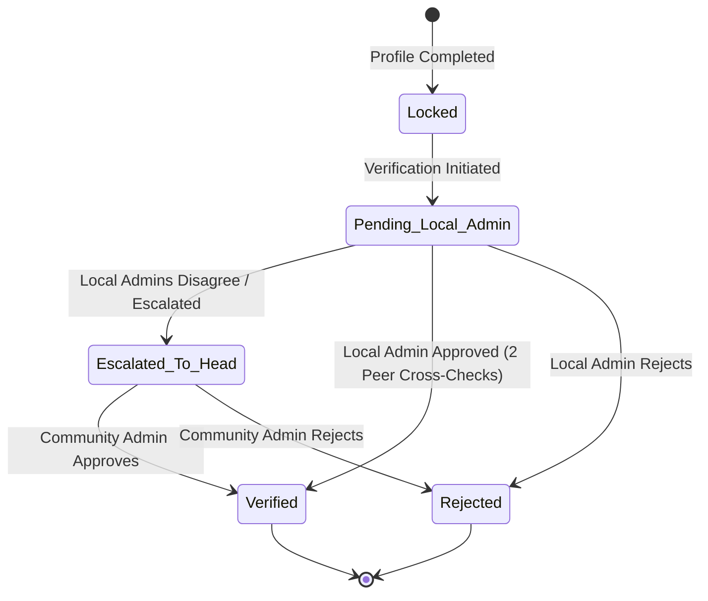
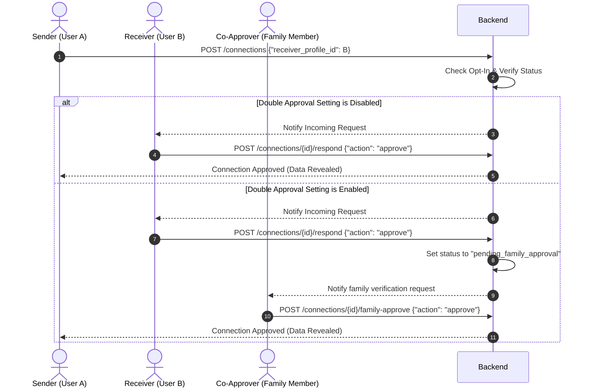

# API Documentation - Community Registry & Matrimonial Platform

**Version:** 1.0 (MVP Scope)  
**Base URL:** `/api/v1`  
**Protocol:** HTTPS  
**Format:** JSON  

---

## 1. API Design Principles

### 1.1 RESTful Architecture
The API is designed around REST principles. Resources are identified by plural nouns in URLs (e.g., `/profiles`, `/family-units`), and standard HTTP methods define the operations:
*   `GET`: Retrieve a resource or list of resources.
*   `POST`: Create a new resource or perform a specialized command.
*   `PUT`: Update an existing resource (full replacement or major modification).
*   `PATCH`: Apply partial modifications to a resource.
*   `DELETE`: Deactivate or archive a resource (soft deletion).

### 1.2 Versioning
All routes are prefixed with `/api/v1/` to ensure backwards compatibility as the platform evolves. Any breaking changes will lead to the introduction of `/api/v2/`.

### 1.3 Consistency in Error Responses
All error responses use a standard JSON envelope with an `error` code/slug and a human-readable `message` to simplify client-side handling.

#### Validation Error Schema (HTTP 422 Unprocessable Entity)
When request payload validation fails (e.g., invalid phone format), the API returns a structured validation error payload:
```json
{
  "detail": [
    {
      "loc": ["body", "phone_number"],
      "msg": "value is not a valid phone number",
      "type": "value_error.any_str"
    }
  ]
}
```

#### Standard Error Schema (HTTP 400, 401, 403, 404, 500)
```json
{
  "error": "ERROR_CODE_SLUG",
  "message": "A human-readable explanation of what went wrong."
}
```

### 1.4 HTTP Status Codes

| Code | Status | Description |
| :--- | :--- | :--- |
| **200** | OK | Request succeeded. Returns requested data. |
| **201** | Created | Resource successfully created. Returns created resource. |
| **204** | No Content | Request succeeded, but there is no response body content (e.g., successful logout). |
| **400** | Bad Request | Request is malformed or violates business logic (e.g., opting in to matrimony while married). |
| **401** | Unauthorized | Authentication is missing or invalid. |
| **403** | Forbidden | User is authenticated but lacks permission for the resource. |
| **404** | Not Found | The requested resource does not exist. |
| **409** | Conflict | The resource state conflicts with request (e.g., profile already verified or duplicate registration). |
| **422** | Unprocessable Entity | Input data failed schema validation checks. |
| **500** | Internal Error | Server encountered an unexpected error. |

---

## 2. Security, Authentication & Access Control

### 2.1 OTP-Based Authentication & JWT
Authentication is passwordless. Users log in by requesting a One-Time Password (OTP) sent to their registered phone number.
Upon verifying the OTP, the system returns:
*   An **Access Token** (short-lived JWT, expires in 15 minutes) passed in the `Authorization: Bearer <token>` header.
*   A **Refresh Token** (long-lived JWT/cookie, expires in 30 days) used to retrieve a new Access Token.

### 2.2 Role-Based Access Control (RBAC)
The system enforces authorization levels mapped to user roles:

| Role Name | Authority Scope |
| :--- | :--- |
| **Community Admin** | Full read/write access. Can resolve verification escalations, manage regions, access dashboard, and convert profiles to memorials. |
| **Local Admin** | Scoped read/write access to assigned geographic region. Can approve/reject verification requests, and cross-verify peer Local Admins. |
| **Family Head** | Can read/write profile details for all members of their Family Unit (including minors). Can approve minors' data and act as a matrimonial co-approver. |
| **Self (Verified Adult)** | Full control of own profile. Can opt-in/out of Matrimony, configure settings, and handle own connection requests. |
| **Minor (Under 18)** | Read-only access to their own profile. No matrimonial features, no connection requests, and no self-edits. |
| **Unverified User** | Restricted access. Can sign up and complete their own profile but cannot browse the registry, view other family units, or request connections. |

### 2.3 Profile Visibility Tiers
To protect user privacy, the profile schema is partitioned into two visibility tiers:

*   **Public Tier:** Visible to all verified community members.
    *   *Fields:* `id`, `full_name`, `age` (calculated from DOB), `gender`, `profile_photo_url`.
*   **Restricted Tier:** Visible only to the profile owner (`Self`), their `Family Head`, `Local Admins`, `Community Admins`, or matrimonial partners with an **approved Connection Request**.
    *   *Fields:* `date_of_birth` (exact), `phone_number`, `address`, `occupation`, `family_unit_id`, `relationship_to_head`.

### 2.4 Edit Conflict Resolution: Self-Edit Priority
Both the `Self` user (if adult) and their `Family Head` have write access to the user's profile. In case of conflicting edits, the **Self-edit takes priority**. The backend enforces this by rejecting updates from a Family Head if the field has been modified directly by the Self-user within a protected timestamp window, or by letting the owner's write override all previous edits.

---

## 3. Workflows & State Machines

### 3.1 Verification Flow
A user begins as `Unverified` and locked out. The verification process follows a multi-party state machine.



### 3.2 Matrimonial Connection Request Flow
Matrimonial profiles operate on a private-account authorization model. Connection requests can follow a single-stage or dual-stage approval process.



---

## 4. Endpoints Reference

### 4.1 Authentication Endpoints

#### 4.1.1 Send OTP
*   **Method:** `POST`
*   **Path:** `/api/v1/auth/otp/send`
*   **Description:** Requests an OTP code to be sent via SMS to the specified mobile phone number.
*   **Auth Required:** None (Public)
*   **Request Body (JSON):**
    ```json
    {
      "phone_number": "+919876543210"
    }
    ```
*   **Response Body (JSON):**
    ```json
    {
      "session_id": "otp_sess_6f2e8d91a0b5",
      "message": "OTP sent successfully. Valid for 5 minutes."
    }
    ```
*   **Query Parameters:** None
*   **Status Codes:**
    *   `200 OK`: OTP successfully generated and sent.
    *   `400 Bad Request`: Phone number format is invalid.
    *   `422 Unprocessable Entity`: Missing fields.

#### 4.1.2 Verify OTP
*   **Method:** `POST`
*   **Path:** `/api/v1/auth/otp/verify`
*   **Description:** Verifies the OTP sent to the user and returns an access token along with user details.
*   **Auth Required:** None (Public)
*   **Request Body (JSON):**
    ```json
    {
      "phone_number": "+919876543210",
      "session_id": "otp_sess_6f2e8d91a0b5",
      "otp_code": "583920"
    }
    ```
*   **Response Body (JSON):**
    ```json
    {
      "access_token": "eyJhbGciOiJIUzI1NiIsInR5cCI6IkpXVCJ9...",
      "refresh_token": "ref_8a2d1f99c0b11e2f3a",
      "token_type": "bearer",
      "expires_in": 900,
      "user": {
        "id": 104,
        "phone_number": "+919876543210",
        "role": "self",
        "is_verified": true,
        "profile_id": 402
      }
    }
    ```
*   **Query Parameters:** None
*   **Status Codes:**
    *   `200 OK`: Verification successful.
    *   `400 Bad Request`: Incorrect OTP code or expired session.
    *   `422 Unprocessable Entity`: Validation failure.

#### 4.1.3 Refresh Token
*   **Method:** `POST`
*   **Path:** `/api/v1/auth/refresh`
*   **Description:** Exchanges a valid refresh token for a new access token.
*   **Auth Required:** None (Requires valid refresh token in payload)
*   **Request Body (JSON):**
    ```json
    {
      "refresh_token": "ref_8a2d1f99c0b11e2f3a"
    }
    ```
*   **Response Body (JSON):**
    ```json
    {
      "access_token": "eyJhbGciOiJIUzI1NiIsInR5cCI6IkpXVCJ9...",
      "refresh_token": "ref_9b3e2a00d1c22f3g4b",
      "token_type": "bearer",
      "expires_in": 900
    }
    ```
*   **Query Parameters:** None
*   **Status Codes:**
    *   `200 OK`: Access token refreshed.
    *   `401 Unauthorized`: Invalid or expired refresh token.

#### 4.1.4 Logout
*   **Method:** `POST`
*   **Path:** `/api/v1/auth/logout`
*   **Description:** Invalidates the provided refresh token and clears the user session.
*   **Auth Required:** Verified User, Unverified User (`Self`, `Family Head`, `Local Admin`, `Community Admin`, `Minor`)
*   **Request Body (JSON):**
    ```json
    {
      "refresh_token": "ref_9b3e2a00d1c22f3g4b"
    }
    ```
*   **Response Body:** None
*   **Query Parameters:** None
*   **Status Codes:**
    *   `204 No Content`: Successfully logged out.
    *   `401 Unauthorized`: Invalid access token.

---

## 4.2 User & Profile Endpoints

#### 4.2.1 Create Profile
*   **Method:** `POST`
*   **Path:** `/api/v1/profiles`
*   **Description:** Creates a new profile. Can be done by an unverified user onboarding themselves, or a Family Head creating a profile for a family member.
*   **Auth Required:** Authenticated User
*   **Request Body (JSON):**
    ```json
    {
      "full_name": "Siddharth Gowda",
      "date_of_birth": "1995-04-12",
      "gender": "Male",
      "marital_status": "Unmarried",
      "phone_number": "+919876543210",
      "address": "45, 2nd Main, Indiranagar, Bengaluru, KA",
      "occupation": "Software Engineer",
      "profile_photo_url": "https://storage.googleapis.com/comm-photos/profile_104.jpg",
      "family_unit_id": 12,
      "relationship_to_head": "Self"
    }
    ```
*   **Response Body (JSON):**
    ```json
    {
      "id": 402,
      "full_name": "Siddharth Gowda",
      "date_of_birth": "1995-04-12",
      "age": 31,
      "gender": "Male",
      "marital_status": "Unmarried",
      "phone_number": "+919876543210",
      "address": "45, 2nd Main, Indiranagar, Bengaluru, KA",
      "occupation": "Software Engineer",
      "profile_photo_url": "https://storage.googleapis.com/comm-photos/profile_104.jpg",
      "family_unit_id": 12,
      "relationship_to_head": "Self",
      "is_verified": false,
      "is_memorial": false,
      "created_at": "2026-06-30T18:30:00Z",
      "updated_at": "2026-06-30T18:30:00Z"
    }
    ```
*   **Query Parameters:** None
*   **Status Codes:**
    *   `201 Created`: Profile successfully created.
    *   `400 Bad Request`: Input payload validation or business logic error.
    *   `409 Conflict`: A profile with this phone number already exists.

#### 4.2.2 Get My Profile
*   **Method:** `GET`
*   **Path:** `/api/v1/profiles/me`
*   **Description:** Retrieves the logged-in user's own profile. Includes all restricted details.
*   **Auth Required:** `Self`, `Family Head`, `Local Admin`, `Community Admin`, `Minor`
*   **Request Body:** None
*   **Response Body (JSON):**
    ```json
    {
      "id": 402,
      "full_name": "Siddharth Gowda",
      "date_of_birth": "1995-04-12",
      "age": 31,
      "gender": "Male",
      "marital_status": "Unmarried",
      "phone_number": "+919876543210",
      "address": "45, 2nd Main, Indiranagar, Bengaluru, KA",
      "occupation": "Software Engineer",
      "profile_photo_url": "https://storage.googleapis.com/comm-photos/profile_104.jpg",
      "family_unit_id": 12,
      "relationship_to_head": "Self",
      "is_verified": true,
      "is_memorial": false
    }
    ```
*   **Query Parameters:** None
*   **Status Codes:**
    *   `200 OK`: Success.
    *   `401 Unauthorized`: Missing or invalid authentication token.

#### 4.2.3 Update My Profile
*   **Method:** `PUT`
*   **Path:** `/api/v1/profiles/me`
*   **Description:** Updates the logged-in user's profile. This update is protected by **Self-Edit Priority**; modifications made directly here override edits requested by a Family Head.
*   **Auth Required:** `Self` (Verified Adult), `Family Head`, `Local Admin`, `Community Admin`
*   **Request Body (JSON):**
    ```json
    {
      "full_name": "Siddharth Gowda",
      "marital_status": "Unmarried",
      "address": "90, 4th Cross, HSR Layout, Bengaluru, KA",
      "occupation": "Senior Software Engineer",
      "profile_photo_url": "https://storage.googleapis.com/comm-photos/profile_104_v2.jpg"
    }
    ```
*   **Response Body (JSON):**
    ```json
    {
      "id": 402,
      "full_name": "Siddharth Gowda",
      "date_of_birth": "1995-04-12",
      "age": 31,
      "gender": "Male",
      "marital_status": "Unmarried",
      "phone_number": "+919876543210",
      "address": "90, 4th Cross, HSR Layout, Bengaluru, KA",
      "occupation": "Senior Software Engineer",
      "profile_photo_url": "https://storage.googleapis.com/comm-photos/profile_104_v2.jpg",
      "family_unit_id": 12,
      "relationship_to_head": "Self",
      "is_verified": true,
      "is_memorial": false,
      "updated_at": "2026-06-30T18:35:00Z"
    }
    ```
*   **Query Parameters:** None
*   **Status Codes:**
    *   `200 OK`: Profile successfully updated.
    *   `400 Bad Request`: Validation failure.

#### 4.2.4 Get Profile by ID
*   **Method:** `GET`
*   **Path:** `/api/v1/profiles/{id}`
*   **Description:** Retrieves a profile by its ID. Enforces tiered visibility based on user access. Returns only Public fields unless the requester is the owner, family head, admin, or has an approved matrimonial connection.
*   **Auth Required:** Verified User
*   **Request Body:** None
*   **Response Body (JSON - Requester has access to Public Tier only):**
    ```json
    {
      "id": 501,
      "full_name": "Ananya Hegde",
      "age": 28,
      "gender": "Female",
      "profile_photo_url": "https://storage.googleapis.com/comm-photos/profile_501.jpg",
      "is_verified": true,
      "is_memorial": false,
      "_visibility_tier": "public"
    }
    ```
*   **Response Body (JSON - Requester has access to Restricted Tier due to Family relation or Approved Connection):**
    ```json
    {
      "id": 501,
      "full_name": "Ananya Hegde",
      "date_of_birth": "1998-09-24",
      "age": 27,
      "gender": "Female",
      "marital_status": "Unmarried",
      "phone_number": "+919988776655",
      "address": "Apartment 4B, Prestige Heights, Bengaluru, KA",
      "occupation": "Architect",
      "profile_photo_url": "https://storage.googleapis.com/comm-photos/profile_501.jpg",
      "family_unit_id": 15,
      "relationship_to_head": "Daughter",
      "is_verified": true,
      "is_memorial": false,
      "_visibility_tier": "restricted"
    }
    ```
*   **Query Parameters:** None
*   **Status Codes:**
    *   `200 OK`: Profile details retrieved.
    *   `401 Unauthorized`: Unauthenticated requester.
    *   `403 Forbidden`: Requester is not verified (pre-verification lock).
    *   `404 Not Found`: Profile not found.

#### 4.2.5 Update Profile by ID
*   **Method:** `PUT`
*   **Path:** `/api/v1/profiles/{id}`
*   **Description:** Allows updates to a specific profile. Write access restricted to the profile owner (`Self`), the `Family Head`, or a `Community Admin`. If the profile owner has modified a field directly, a Family Head cannot override it (Self-edit priority logic applies).
*   **Auth Required:** `Self`, `Family Head`, or `Community Admin`
*   **Request Body (JSON):**
    ```json
    {
      "full_name": "Ananya Hegde",
      "marital_status": "Unmarried",
      "address": "Apartment 5C, Prestige Heights, Bengaluru, KA",
      "occupation": "Senior Architect"
    }
    ```
*   **Response Body (JSON):**
    ```json
    {
      "id": 501,
      "full_name": "Ananya Hegde",
      "date_of_birth": "1998-09-24",
      "age": 27,
      "gender": "Female",
      "marital_status": "Unmarried",
      "phone_number": "+919988776655",
      "address": "Apartment 5C, Prestige Heights, Bengaluru, KA",
      "occupation": "Senior Architect",
      "profile_photo_url": "https://storage.googleapis.com/comm-photos/profile_501.jpg",
      "family_unit_id": 15,
      "relationship_to_head": "Daughter",
      "is_verified": true,
      "is_memorial": false,
      "updated_at": "2026-06-30T18:36:00Z"
    }
    ```
*   **Query Parameters:** None
*   **Status Codes:**
    *   `200 OK`: Profile updated.
    *   `403 Forbidden`: Requester is not authorized to edit this profile, or is a Family Head attempting to override a prioritized Self-edited field.
    *   `404 Not Found`: Profile not found.

---

## 4.3 Family Unit Endpoints

#### 4.3.1 Create Family Unit
*   **Method:** `POST`
*   **Path:** `/api/v1/family-units`
*   **Description:** Instantiates a new Family Unit. The creator is designated as the `Family Head` by default unless specified otherwise.
*   **Auth Required:** Verified Adult (`Self`, `Local Admin`, `Community Admin`)
*   **Request Body (JSON):**
    ```json
    {
      "family_name": "Gowda Household",
      "head_profile_id": 402,
      "ancestral_origin_village": "Hassan"
    }
    ```
*   **Response Body (JSON):**
    ```json
    {
      "id": 12,
      "family_name": "Gowda Household",
      "head_profile_id": 402,
      "ancestral_origin_village": "Hassan",
      "members_count": 1,
      "created_at": "2026-06-30T18:40:00Z"
    }
    ```
*   **Query Parameters:** None
*   **Status Codes:**
    *   `201 Created`: Family unit successfully generated.
    *   `400 Bad Request`: Head profile ID is invalid or already associated with another family unit.

#### 4.3.2 Get Family Unit
*   **Method:** `GET`
*   **Path:** `/api/v1/family-units/{id}`
*   **Description:** Retrieves metadata of a Family Unit and lists all linked profiles. Non-family members (if verified) see names and public fields only; family members and admins see full restricted details.
*   **Auth Required:** Verified User
*   **Request Body:** None
*   **Response Body (JSON - Requester is a Member or Admin):**
    ```json
    {
      "id": 12,
      "family_name": "Gowda Household",
      "head_profile_id": 402,
      "ancestral_origin_village": "Hassan",
      "members": [
        {
          "id": 402,
          "full_name": "Siddharth Gowda",
          "relationship_to_head": "Self",
          "age": 31,
          "gender": "Male",
          "phone_number": "+919876543210",
          "is_verified": true
        },
        {
          "id": 610,
          "full_name": "Karan Gowda",
          "relationship_to_head": "Son",
          "age": 12,
          "gender": "Male",
          "phone_number": null,
          "is_verified": true
        }
      ]
    }
    ```
*   **Query Parameters:** None
*   **Status Codes:**
    *   `200 OK`: Details retrieved.
    *   `404 Not Found`: Family unit not found.

#### 4.3.3 Update Family Unit
*   **Method:** `PUT`
*   **Path:** `/api/v1/family-units/{id}`
*   **Description:** Updates Family Unit metadata (e.g. changing the designated head).
*   **Auth Required:** `Family Head` of this unit, or `Community Admin`
*   **Request Body (JSON):**
    ```json
    {
      "family_name": "Gowda Family Trust",
      "head_profile_id": 402,
      "ancestral_origin_village": "Hassan - Sakleshpur"
    }
    ```
*   **Response Body (JSON):**
    ```json
    {
      "id": 12,
      "family_name": "Gowda Family Trust",
      "head_profile_id": 402,
      "ancestral_origin_village": "Hassan - Sakleshpur",
      "updated_at": "2026-06-30T18:41:00Z"
    }
    ```
*   **Query Parameters:** None
*   **Status Codes:**
    *   `200 OK`: Metadata updated.
    *   `403 Forbidden`: User is not authorized to edit this family unit.

#### 4.3.4 Add Minor to Family Unit
*   **Method:** `POST`
*   **Path:** `/api/v1/family-units/{id}/minors`
*   **Description:** Creates a profile for a minor (under 18) within the family unit. The minor account will have view-only access and cannot edit or request connections.
*   **Auth Required:** `Family Head` of this unit, or `Community Admin`
*   **Request Body (JSON):**
    ```json
    {
      "full_name": "Karan Gowda",
      "date_of_birth": "2014-08-15",
      "gender": "Male",
      "address": "90, 4th Cross, HSR Layout, Bengaluru, KA",
      "relationship_to_head": "Son",
      "profile_photo_url": "https://storage.googleapis.com/comm-photos/minor_610.jpg"
    }
    ```
*   **Response Body (JSON):**
    ```json
    {
      "id": 610,
      "full_name": "Karan Gowda",
      "date_of_birth": "2014-08-15",
      "age": 11,
      "gender": "Male",
      "marital_status": "Unmarried",
      "address": "90, 4th Cross, HSR Layout, Bengaluru, KA",
      "profile_photo_url": "https://storage.googleapis.com/comm-photos/minor_610.jpg",
      "family_unit_id": 12,
      "relationship_to_head": "Son",
      "is_verified": true,
      "is_minor": true,
      "created_at": "2026-06-30T18:42:00Z"
    }
    ```
*   **Query Parameters:** None
*   **Status Codes:**
    *   `201 Created`: Minor profile successfully created.
    *   `400 Bad Request`: Provided Date of Birth would make the person 18 or older.
    *   `403 Forbidden`: Requester is not authorized to add minors.

---

## 4.4 Verification Endpoints

#### 4.4.1 Request Verification
*   **Method:** `POST`
*   **Path:** `/api/v1/verifications/request`
*   **Description:** Initiates a verification request for a newly created profile, locking the profile state to "pending".
*   **Auth Required:** Owner (`Self`), or `Family Head`
*   **Request Body (JSON):**
    ```json
    {
      "profile_id": 402,
      "supporting_documents": [
        "https://storage.googleapis.com/comm-docs/verification_doc_402.pdf"
      ]
    }
    ```
*   **Response Body (JSON):**
    ```json
    {
      "request_id": 88,
      "profile_id": 402,
      "status": "pending_local_admin",
      "created_at": "2026-06-30T18:43:00Z"
    }
    ```
*   **Query Parameters:** None
*   **Status Codes:**
    *   `201 Created`: Verification workflow started.
    *   `409 Conflict`: Verification request already exists or profile is already verified.

#### 4.4.2 List Pending Verifications
*   **Method:** `GET`
*   **Path:** `/api/v1/verifications/pending`
*   **Description:** Returns a list of pending verification requests. Scoped by region for Local Admins; lists all for Community Admin.
*   **Auth Required:** `Local Admin`, `Community Admin`
*   **Request Body:** None
*   **Response Body (JSON):**
    ```json
    {
      "requests": [
        {
          "request_id": 88,
          "profile_id": 402,
          "full_name": "Siddharth Gowda",
          "region_id": 4,
          "region_name": "Bengaluru South",
          "created_at": "2026-06-30T18:43:00Z",
          "status": "pending_local_admin"
        }
      ]
    }
    ```
*   **Query Parameters:**

| Parameter | Type | Required | Description |
| :--- | :--- | :--- | :--- |
| `region_id` | Integer | No | Filter requests by a specific geographic region. |
| `page` | Integer | No | Pagination page index (default: 1). |
| `limit` | Integer | No | Number of records to return (default: 20). |

*   **Status Codes:**
    *   `200 OK`: Successfully returned list.
    *   `403 Forbidden`: Requester does not have admin permissions.

#### 4.4.3 Approve Verification
*   **Method:** `POST`
*   **Path:** `/api/v1/verifications/{request_id}/approve`
*   **Description:** Approves a verification request. Local Admins must verify profiles within their assigned regions. Requires peer cross-validation (at least one other Local Admin signature or Community Admin override).
*   **Auth Required:** `Local Admin`, `Community Admin`
*   **Request Body (JSON):**
    ```json
    {
      "comments": "Address and identity check completed via phone call and document review."
    }
    ```
*   **Response Body (JSON):**
    ```json
    {
      "request_id": 88,
      "profile_id": 402,
      "status": "verified",
      "approved_by": [1002],
      "comments": "Address and identity check completed via phone call and document review.",
      "verified_at": "2026-06-30T18:45:00Z"
    }
    ```
*   **Query Parameters:** None
*   **Status Codes:**
    *   `200 OK`: Request approved.
    *   `403 Forbidden`: Admin region mismatch or unauthorized action.
    *   `404 Not Found`: Verification request not found.

#### 4.4.4 Reject Verification
*   **Method:** `POST`
*   **Path:** `/api/v1/verifications/{request_id}/reject`
*   **Description:** Rejections a verification request, returning the user's profile to a locked, editable state to address issues.
*   **Auth Required:** `Local Admin`, `Community Admin`
*   **Request Body (JSON):**
    ```json
    {
      "rejection_reason": "Uploaded document is blurred. Please upload a clear photo page."
    }
    ```
*   **Response Body (JSON):**
    ```json
    {
      "request_id": 88,
      "profile_id": 402,
      "status": "rejected",
      "rejection_reason": "Uploaded document is blurred. Please upload a clear photo page.",
      "rejected_at": "2026-06-30T18:46:00Z"
    }
    ```
*   **Query Parameters:** None
*   **Status Codes:**
    *   `200 OK`: Request successfully rejected.
    *   `403 Forbidden`: Permission denied.

#### 4.4.5 Escalate Verification
*   **Method:** `POST`
*   **Path:** `/api/v1/verifications/{request_id}/escalate`
*   **Description:** Escalates a disputed verification request directly to the Community Admin (Head) to resolve conflicts.
*   **Auth Required:** `Local Admin`
*   **Request Body (JSON):**
    ```json
    {
      "escalation_reason": "Disagreement between Local Admins on residence verification."
    }
    ```
*   **Response Body (JSON):**
    ```json
    {
      "request_id": 88,
      "profile_id": 402,
      "status": "escalated_to_head",
      "escalated_by": 1002,
      "escalation_reason": "Disagreement between Local Admins on residence verification.",
      "escalated_at": "2026-06-30T18:47:00Z"
    }
    ```
*   **Query Parameters:** None
*   **Status Codes:**
    *   `200 OK`: Verification request escalated.
    *   `403 Forbidden`: Only Local Admins can escalate.

---

### 4.5 Matrimonial Endpoints

#### 4.5.1 Opt-In to Matrimonial Module
*   **Method:** `POST`
*   **Path:** `/api/v1/matrimonial/opt-in`
*   **Description:** Opts a verified, unmarried, adult member into the matrimonial matchmaking system. Allows configuring optional family co-approval at setup.
*   **Auth Required:** `Self` (Verified Adult)
*   **Request Body (JSON):**
    ```json
    {
      "require_double_approval": true,
      "family_co_approver_profile_id": 305
    }
    ```
*   **Response Body (JSON):**
    ```json
    {
      "profile_id": 402,
      "matrimonial_status": "opted_in",
      "require_double_approval": true,
      "family_co_approver_profile_id": 305,
      "opted_in_at": "2026-06-30T18:48:00Z"
    }
    ```
*   **Query Parameters:** None
*   **Status Codes:**
    *   `200 OK`: Successfully opted in.
    *   `400 Bad Request`: User is not eligible (e.g., married, under 18, or not verified).

#### 4.5.2 Configure Matrimonial Settings
*   **Method:** `PUT`
*   **Path:** `/api/v1/matrimonial/settings`
*   **Description:** Updates matrimonial preferences, including double approval toggles and co-approver details.
*   **Auth Required:** `Self` (Verified Adult, Opted in)
*   **Request Body (JSON):**
    ```json
    {
      "require_double_approval": false,
      "family_co_approver_profile_id": null
    }
    ```
*   **Response Body (JSON):**
    ```json
    {
      "profile_id": 402,
      "require_double_approval": false,
      "family_co_approver_profile_id": null,
      "updated_at": "2026-06-30T18:49:00Z"
    }
    ```
*   **Query Parameters:** None
*   **Status Codes:**
    *   `200 OK`: Settings updated.
    *   `400 Bad Request`: Invalid co-approver selected.

#### 4.5.3 Browse Matrimonial Profiles
*   **Method:** `GET`
*   **Path:** `/api/v1/matrimonial/profiles`
*   **Description:** Browses matrimonial database. Returns only Public Tier fields (`id`, `full_name`, `age`, `gender`, `profile_photo_url`) unless a connection request has been mutually approved.
*   **Auth Required:** Verified Adult (Opted into Matrimony)
*   **Request Body:** None
*   **Response Body (JSON):**
    ```json
    {
      "results": [
        {
          "profile_id": 501,
          "full_name": "Ananya Hegde",
          "age": 28,
          "gender": "Female",
          "profile_photo_url": "https://storage.googleapis.com/comm-photos/profile_501.jpg",
          "connection_status": "none"
        }
      ],
      "pagination": {
        "page": 1,
        "limit": 10,
        "total_results": 45
      }
    }
    ```
*   **Query Parameters:**

| Parameter | Type | Required | Description |
| :--- | :--- | :--- | :--- |
| `gender` | String | No | Filter by gender (`Male`/`Female`). |
| `age_min` | Integer | No | Minimum age filter. |
| `age_max` | Integer | No | Maximum age filter. |
| `page` | Integer | No | Page number (default: 1). |
| `limit` | Integer | No | Records per page (default: 10). |

*   **Status Codes:**
    *   `200 OK`: Matrimonial listings retrieved.
    *   `403 Forbidden`: User has not opted into the matrimonial module.

#### 4.5.4 Opt-Out of Matrimonial Module
*   **Method:** `POST`
*   **Path:** `/api/v1/matrimonial/opt-out`
*   **Description:** Suspends or removes profile from the matrimonial browse listing. Active connection requests remain but cannot be modified.
*   **Auth Required:** `Self` (Verified Adult)
*   **Request Body:** None
*   **Response Body (JSON):**
    ```json
    {
      "profile_id": 402,
      "matrimonial_status": "opted_out",
      "opted_out_at": "2026-06-30T18:50:00Z"
    }
    ```
*   **Query Parameters:** None
*   **Status Codes:**
    *   `200 OK`: Matrimonial access deactivated.

---

### 4.6 Connection Request Endpoints

#### 4.6.1 Send Connection Request
*   **Method:** `POST`
*   **Path:** `/api/v1/connections`
*   **Description:** Sends a matrimonial connection interest request.
*   **Auth Required:** Verified Adult (Opted into Matrimony)
*   **Request Body (JSON):**
    ```json
    {
      "receiver_profile_id": 501
    }
    ```
*   **Response Body (JSON):**
    ```json
    {
      "connection_id": 312,
      "sender_profile_id": 402,
      "receiver_profile_id": 501,
      "status": "pending_self_approval",
      "created_at": "2026-06-30T18:51:00Z"
    }
    ```
*   **Query Parameters:** None
*   **Status Codes:**
    *   `201 Created`: Request sent successfully.
    *   `400 Bad Request`: Cannot send request to yourself or someone who is not opted in.
    *   `409 Conflict`: Active connection request already exists.

#### 4.6.2 List Connection Requests
*   **Method:** `GET`
*   **Path:** `/api/v1/connections`
*   **Description:** Lists all incoming, outgoing, or family-approval pending connection requests.
*   **Auth Required:** Verified Adult (Opted into Matrimony or designated Co-Approver)
*   **Request Body:** None
*   **Response Body (JSON):**
    ```json
    {
      "connections": [
        {
          "connection_id": 312,
          "sender_profile_id": 402,
          "sender_name": "Siddharth Gowda",
          "receiver_profile_id": 501,
          "status": "pending_self_approval",
          "direction": "incoming",
          "created_at": "2026-06-30T18:51:00Z"
        }
      ]
    }
    ```
*   **Query Parameters:**

| Parameter | Type | Required | Description |
| :--- | :--- | :--- | :--- |
| `type` | String | No | Filter by request direction: `incoming`, `outgoing`, or `family`. |
| `status` | String | No | Filter by state: `pending_self_approval`, `pending_family_approval`, `approved`, `rejected`. |

*   **Status Codes:**
    *   `200 OK`: Request list retrieved.

#### 4.6.3 Respond to Connection Request (Self-Approval)
*   **Method:** `POST`
*   **Path:** `/api/v1/connections/{connection_id}/respond`
*   **Description:** Accept or decline a matrimonial connection request. If double approval is configured, accepting moves the request to `pending_family_approval`.
*   **Auth Required:** Receiver (`Self` owner of the target profile)
*   **Request Body (JSON):**
    ```json
    {
      "action": "approve"
    }
    ```
*   **Response Body (JSON - Case: Double Approval Enabled):**
    ```json
    {
      "connection_id": 312,
      "status": "pending_family_approval",
      "updated_at": "2026-06-30T18:53:00Z"
    }
    ```
*   **Response Body (JSON - Case: Double Approval Disabled, Connection Complete):**
    ```json
    {
      "connection_id": 312,
      "status": "approved",
      "details_revealed": {
        "phone_number": "+919876543210",
        "address": "90, 4th Cross, HSR Layout, Bengaluru, KA",
        "occupation": "Senior Software Engineer"
      },
      "updated_at": "2026-06-30T18:53:00Z"
    }
    ```
*   **Query Parameters:** None
*   **Status Codes:**
    *   `200 OK`: Response updated.
    *   `400 Bad Request`: Invalid action (must be `approve` or `reject`).
    *   `403 Forbidden`: Requester is not the target receiver.

#### 4.6.4 Family Co-Approve Connection Request
*   **Method:** `POST`
*   **Path:** `/api/v1/connections/{connection_id}/family-approve`
*   **Description:** Approves or declines a connection request as the designated family co-approver.
*   **Auth Required:** Designated Co-Approver
*   **Request Body (JSON):**
    ```json
    {
      "action": "approve"
    }
    ```
*   **Response Body (JSON):**
    ```json
    {
      "connection_id": 312,
      "status": "approved",
      "details_revealed": {
        "phone_number": "+919876543210",
        "address": "90, 4th Cross, HSR Layout, Bengaluru, KA",
        "occupation": "Senior Software Engineer"
      },
      "family_approved_by": 305,
      "updated_at": "2026-06-30T18:54:00Z"
    }
    ```
*   **Query Parameters:** None
*   **Status Codes:**
    *   `200 OK`: Family co-approval registered.
    *   `403 Forbidden`: Requester is not the designated co-approver.

---

### 4.7 Admin Endpoints

#### 4.7.1 Admin Dashboard Stats
*   **Method:** `GET`
*   **Path:** `/api/v1/admin/dashboard/stats`
*   **Description:** Fetches general statistics for verification activities and platform usage.
*   **Auth Required:** `Community Admin`
*   **Request Body:** None
*   **Response Body (JSON):**
    ```json
    {
      "total_members": 10450,
      "verified_members": 9820,
      "pending_verifications": 15,
      "escalated_verifications": 3,
      "matrimonial_opt_ins": 420,
      "active_connections": 85
    }
    ```
*   **Query Parameters:** None
*   **Status Codes:**
    *   `200 OK`: Statistics retrieved.
    *   `403 Forbidden`: Requester is not a Community Admin.

#### 4.7.2 Manage Regions
*   **Method:** `GET`
*   **Path:** `/api/v1/admin/regions`
*   **Description:** Retrieves all geographic regions mapped to local admins.
*   **Auth Required:** `Local Admin`, `Community Admin`
*   **Request Body:** None
*   **Response Body (JSON):**
    ```json
    {
      "regions": [
        {
          "region_id": 4,
          "region_name": "Bengaluru South",
          "assigned_admins": [
            {
              "admin_profile_id": 1002,
              "admin_name": "Ramesh Gowda"
            }
          ]
        }
      ]
    }
    ```
*   **Query Parameters:** None
*   **Status Codes:**
    *   `200 OK`: Regions returned.

#### 4.7.3 Create Region
*   **Method:** `POST`
*   **Path:** `/api/v1/admin/regions`
*   **Description:** Defines a new geographic administration region.
*   **Auth Required:** `Community Admin`
*   **Request Body (JSON):**
    ```json
    {
      "region_name": "Bengaluru East"
    }
    ```
*   **Response Body (JSON):**
    ```json
    {
      "region_id": 5,
      "region_name": "Bengaluru East",
      "created_at": "2026-06-30T18:55:00Z"
    }
    ```
*   **Query Parameters:** None
*   **Status Codes:**
    *   `201 Created`: Region created.

#### 4.7.4 Profile Memorial Handling (Deactivation)
*   **Method:** `POST`
*   **Path:** `/api/v1/admin/profiles/{profile_id}/memorialize`
*   **Description:** Deactivates a profile and converts it into a read-only **Memorial Record** upon verification of death.
*   **Auth Required:** `Community Admin`
*   **Request Body (JSON):**
    ```json
    {
      "date_of_death": "2026-05-10",
      "notes": "Announced and verified via Family Head and Community Trust Notice."
    }
    ```
*   **Response Body (JSON):**
    ```json
    {
      "profile_id": 204,
      "is_verified": false,
      "is_memorial": true,
      "deactivated_at": "2026-06-30T18:56:00Z",
      "notes": "Announced and verified via Family Head and Community Trust Notice."
    }
    ```
*   **Query Parameters:** None
*   **Status Codes:**
    *   `200 OK`: Profile successfully memorialized and converted to read-only.
    *   `404 Not Found`: Profile not found.

#### 4.7.5 Get Audit Logs
*   **Method:** `GET`
*   **Path:** `/api/v1/admin/audit-logs`
*   **Description:** Returns audit trails of administrator and verification actions.
*   **Auth Required:** `Community Admin`
*   **Request Body:** None
*   **Response Body (JSON):**
    ```json
    {
      "logs": [
        {
          "log_id": 4820,
          "admin_profile_id": 1002,
          "action": "approve_verification",
          "target_profile_id": 402,
          "timestamp": "2026-06-30T18:45:00Z",
          "details": "Approved verification request ID 88"
        }
      ]
    }
    ```
*   **Query Parameters:**

| Parameter | Type | Required | Description |
| :--- | :--- | :--- | :--- |
| `action` | String | No | Filter logs by action (e.g., `approve_verification`, `memorialize`). |
| `page` | Integer | No | Pagination page index. |
| `limit` | Integer | No | Page limit. |

*   **Status Codes:**
    *   `200 OK`: Logs successfully retrieved.

---

## 4.8 Search & Browse

#### 4.8.1 Search Registry
*   **Method:** `GET`
*   **Path:** `/api/v1/search/registry`
*   **Description:** Queries and browses the Community Registry database. Access is protected and returns Public Tier data of matched members.
*   **Auth Required:** Verified User (`Self`, `Family Head`, `Local Admin`, `Community Admin`)
*   **Request Body:** None
*   **Response Body (JSON):**
    ```json
    {
      "results": [
        {
          "id": 402,
          "full_name": "Siddharth Gowda",
          "age": 31,
          "gender": "Male",
          "profile_photo_url": "https://storage.googleapis.com/comm-photos/profile_104.jpg"
        }
      ],
      "pagination": {
        "page": 1,
        "limit": 10,
        "total_results": 1
      }
    }
    ```
*   **Query Parameters:**

| Parameter | Type | Required | Description |
| :--- | :--- | :--- | :--- |
| `query` | String | Yes | Name lookup substring. |
| `gender` | String | No | Filter search results by gender (`Male`/`Female`). |
| `marital_status` | String | No | Filter by marital status (`Unmarried`/`Married`/`Divorced`/`Widowed`). |
| `region_id` | Integer | No | Filter by geographic area. |
| `page` | Integer | No | Pagination page. |
| `limit` | Integer | No | Pagination size. |

*   **Status Codes:**
    *   `200 OK`: Query successful.
    *   `400 Bad Request`: Missing mandatory parameters.
    *   `403 Forbidden`: Requester is not verified (pre-verification lock).
