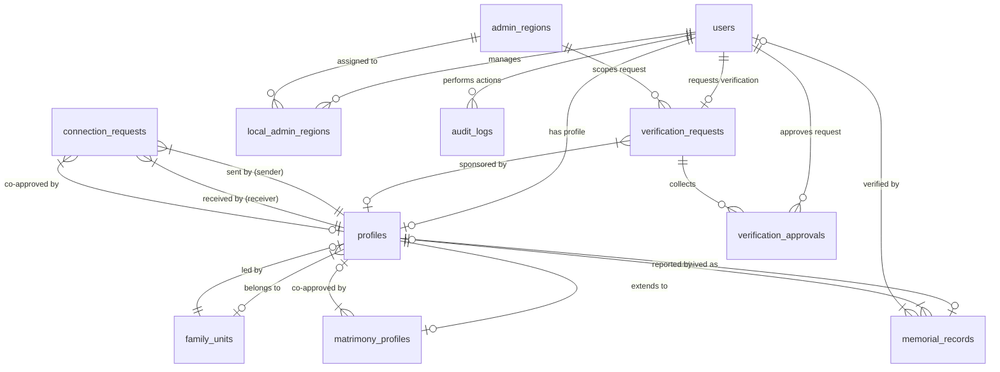

# Database Design Document
## Community Registry & Matrimonial Platform

**Version:** 1.0
**Database Engine:** PostgreSQL (v13+)
**Status:** Approved for Implementation

---

## 1. Overview of Database Design Approach

The database architecture for the **Community Registry & Matrimonial Platform** is built on a **relational, security-first, and highly normalized schema** in PostgreSQL. The design is structured to satisfy the closed, trust-backed nature of the community platform, enforcing strict access boundaries and data integrity directly at the database level.

### Key Architectural Choices:
- **UUID-based Identifiers**: All table primary keys use `UUID` (specifically generated via PostgreSQL `gen_random_uuid()`) instead of auto-incrementing integers. This protects against resource enumeration attacks (e.g., malicious actors guessing member profile URLs) and simplifies eventual multi-region data merging.
- **Relational Normalization**: Core tables are separated to distinguish authentication details (`users`) from registry identity (`profiles`), matrimonial listings (`matrimony_profiles`), and archived deceased data (`memorial_records`). This minimizes data leakage and separates concerns.
- **Database-Level Constraints and Triggers**: Business logic validation (e.g., preventing minors under 18 from participating in matrimonial matches, auto-deactivating accounts upon death) is enforced at the database level using constraints, triggers, and stored procedures, ensuring data sanity regardless of backend client behavior.
- **Audit Trails**: Every write operation, role shift, and verification approval is audited with structured JSON log payloads for compliance and tracking.

---

## 2. Entity Relationship Diagram (ERD)

The following Mermaid diagram shows the relationships, foreign keys, and cardinalities between the tables:



---

## 3. Database Enums

To maintain strict type safety, PostgreSQL custom `ENUM` types are used.

```sql
-- Represents the role of the user inside the application
CREATE TYPE user_role AS ENUM (
    'community_admin', -- Overall platform supervisor
    'local_admin',     -- Regional admin
    'verified_adult',  -- Regular verified adult member (18+)
    'minor',           -- Read-only child account (under 18)
    'unverified'       -- Newly registered account, locked state
);

-- Tracks status transitions of user registration verification
CREATE TYPE verification_status AS ENUM (
    'pending',
    'local_approved',
    'local_rejected',
    'approved',        -- Full approval
    'rejected',        -- Rejected by admin
    'escalated'        -- Escalated to Community Admin due to local conflict
);

-- Registry demographics
CREATE TYPE gender AS ENUM (
    'male',
    'female',
    'other'
);

-- Marital statuses for members
CREATE TYPE marital_status AS ENUM (
    'single',
    'married',
    'divorced',
    'widowed'
);

-- Connection request state machine for matrimonial module
CREATE TYPE connection_request_status AS ENUM (
    'pending_self_approval',   -- Sent, waiting for receiver self-approval
    'pending_family_approval', -- Self-approved, waiting for family co-approver
    'approved',                -- Mutual/Family approval granted (details unlocked)
    'declined_by_self',        -- Declined by receiver
    'declined_by_family',      -- Declined by family co-approver
    'revoked'                  -- Sender canceled the request
);
```

---

## 4. Detailed Table Schemas

### 4.1 `users`
Stores authentication credentials, security status, and core platform roles.

| Column Name | Data Type | Constraints | Default | Description |
| :--- | :--- | :--- | :--- | :--- |
| `id` | `UUID` | `PRIMARY KEY` | `gen_random_uuid()` | Unique user identifier. |
| `phone_number` | `VARCHAR(15)` | `UNIQUE`, `NOT NULL` | *None* | Primary credential for OTP auth (E.164 format). |
| `email` | `VARCHAR(255)` | `UNIQUE`, `NULLABLE` | *None* | Optional email address. |
| `password_hash` | `VARCHAR(255)` | `NULLABLE` | *None* | Backup password hash (primarily for admins). |
| `role` | `user_role` | `NOT NULL` | `'unverified'` | Application level role. |
| `is_active` | `BOOLEAN` | `NOT NULL` | `TRUE` | False if user account is deactivated/deceased. |
| `created_at` | `TIMESTAMPTZ` | `NOT NULL` | `CURRENT_TIMESTAMP` | Signup timestamp. |
| `updated_at` | `TIMESTAMPTZ` | `NOT NULL` | `CURRENT_TIMESTAMP` | Row modification timestamp. |

```sql
CREATE TABLE users (
    id UUID PRIMARY KEY DEFAULT gen_random_uuid(),
    phone_number VARCHAR(15) UNIQUE NOT NULL CHECK (phone_number ~ '^\+[1-9]\d{1,14}$'),
    email VARCHAR(255) UNIQUE CHECK (email IS NULL OR email ~* '^[A-Za-z0-9._%-]+@[A-Za-z0-9.-]+\.[A-Za-z]{2,4}$'),
    password_hash VARCHAR(255),
    role user_role NOT NULL DEFAULT 'unverified',
    is_active BOOLEAN NOT NULL DEFAULT TRUE,
    created_at TIMESTAMPTZ NOT NULL DEFAULT CURRENT_TIMESTAMP,
    updated_at TIMESTAMPTZ NOT NULL DEFAULT CURRENT_TIMESTAMP
);
```

### 4.2 `admin_regions`
Defines regional/geographical scopes governed by Local Admins.

| Column Name | Data Type | Constraints | Default | Description |
| :--- | :--- | :--- | :--- | :--- |
| `id` | `UUID` | `PRIMARY KEY` | `gen_random_uuid()` | Unique region identifier. |
| `name` | `VARCHAR(100)` | `UNIQUE`, `NOT NULL` | *None* | Region name (e.g. 'Bengaluru North'). |
| `description` | `TEXT` | `NULLABLE` | *None* | Description of geographic boundaries. |
| `created_at` | `TIMESTAMPTZ` | `NOT NULL` | `CURRENT_TIMESTAMP` | Record creation timestamp. |
| `updated_at` | `TIMESTAMPTZ` | `NOT NULL` | `CURRENT_TIMESTAMP` | Row modification timestamp. |

```sql
CREATE TABLE admin_regions (
    id UUID PRIMARY KEY DEFAULT gen_random_uuid(),
    name VARCHAR(100) UNIQUE NOT NULL,
    description TEXT,
    created_at TIMESTAMPTZ NOT NULL DEFAULT CURRENT_TIMESTAMP,
    updated_at TIMESTAMPTZ NOT NULL DEFAULT CURRENT_TIMESTAMP
);
```

### 4.3 `local_admin_regions`
Join table mapping Local Admins to their respective regional jurisdictions.

| Column Name | Data Type | Constraints | Default | Description |
| :--- | :--- | :--- | :--- | :--- |
| `user_id` | `UUID` | `PRIMARY KEY`, `FK -> users(id)` | *None* | Reference to the Local Admin user. |
| `region_id` | `UUID` | `PRIMARY KEY`, `FK -> admin_regions(id)` | *None* | Reference to the governed region. |
| `assigned_at` | `TIMESTAMPTZ` | `NOT NULL` | `CURRENT_TIMESTAMP` | Timestamp of administrative assignment. |

```sql
CREATE TABLE local_admin_regions (
    user_id UUID REFERENCES users(id) ON DELETE CASCADE,
    region_id UUID REFERENCES admin_regions(id) ON DELETE CASCADE,
    assigned_at TIMESTAMPTZ NOT NULL DEFAULT CURRENT_TIMESTAMP,
    PRIMARY KEY (user_id, region_id)
);
```

### 4.4 `family_units`
Groups profiles into a cohesive family registry unit.

| Column Name | Data Type | Constraints | Default | Description |
| :--- | :--- | :--- | :--- | :--- |
| `id` | `UUID` | `PRIMARY KEY` | `gen_random_uuid()` | Unique family unit identifier. |
| `name` | `VARCHAR(100)` | `NOT NULL` | *None* | Family name/title (e.g. 'Yaligar Family'). |
| `family_head_id` | `UUID` | `NULLABLE`, `FK -> profiles(id)` | *None* | Reference to the designated Head of Family. |
| `created_at` | `TIMESTAMPTZ` | `NOT NULL` | `CURRENT_TIMESTAMP` | Family creation timestamp. |
| `updated_at` | `TIMESTAMPTZ` | `NOT NULL` | `CURRENT_TIMESTAMP` | Row modification timestamp. |

```sql
CREATE TABLE family_units (
    id UUID PRIMARY KEY DEFAULT gen_random_uuid(),
    name VARCHAR(100) NOT NULL,
    family_head_id UUID, -- Foreign Key to profiles added in step 4.5
    created_at TIMESTAMPTZ NOT NULL DEFAULT CURRENT_TIMESTAMP,
    updated_at TIMESTAMPTZ NOT NULL DEFAULT CURRENT_TIMESTAMP
);
```

### 4.5 `profiles`
The primary member registry table. Contains demographic and contact data.

| Column Name | Data Type | Constraints | Default | Description |
| :--- | :--- | :--- | :--- | :--- |
| `id` | `UUID` | `PRIMARY KEY` | `gen_random_uuid()` | Unique profile identifier. |
| `user_id` | `UUID` | `UNIQUE`, `NULLABLE`, `FK -> users(id)` | *None* | Associated login account. Null for minors/unclaimed accounts. |
| `family_unit_id` | `UUID` | `NULLABLE`, `FK -> family_units(id)` | *None* | Registry family grouping. |
| `full_name` | `VARCHAR(100)` | `NOT NULL` | *None* | Official full name of the member. |
| `date_of_birth` | `DATE` | `NOT NULL` | *None* | Birth date (used for age/minor check). |
| `gender` | `gender` | `NOT NULL` | *None* | Gender selection. |
| `marital_status`| `marital_status` | `NOT NULL` | `'single'` | Marital status. |
| `profile_photo_url`| `VARCHAR(512)`| `NOT NULL` | *None* | URL to public profile image in Cloud Storage. |
| `contact_number` | `VARCHAR(15)` | `NULLABLE` | *None* | Contact number (mandatory for adults). |
| `address` | `TEXT` | `NOT NULL` | *None* | Geographic address details. |
| `occupation` | `VARCHAR(100)` | `NULLABLE` | *None* | Job title or sector. |
| `is_memorial` | `BOOLEAN` | `NOT NULL` | `FALSE` | Flag indicating if this profile represents a deceased member. |
| `created_at` | `TIMESTAMPTZ` | `NOT NULL` | `CURRENT_TIMESTAMP` | Profile creation timestamp. |
| `updated_at` | `TIMESTAMPTZ` | `NOT NULL` | `CURRENT_TIMESTAMP` | Row modification timestamp. |

```sql
CREATE TABLE profiles (
    id UUID PRIMARY KEY DEFAULT gen_random_uuid(),
    user_id UUID UNIQUE REFERENCES users(id) ON DELETE SET NULL,
    family_unit_id UUID REFERENCES family_units(id) ON DELETE SET NULL,
    full_name VARCHAR(100) NOT NULL,
    date_of_birth DATE NOT NULL CHECK (date_of_birth <= CURRENT_DATE),
    gender gender NOT NULL,
    marital_status marital_status NOT NULL DEFAULT 'single',
    profile_photo_url VARCHAR(512) NOT NULL,
    contact_number VARCHAR(15) CHECK (contact_number IS NULL OR contact_number ~ '^\+[1-9]\d{1,14}$'),
    address TEXT NOT NULL,
    occupation VARCHAR(100),
    is_memorial BOOLEAN NOT NULL DEFAULT FALSE,
    created_at TIMESTAMPTZ NOT NULL DEFAULT CURRENT_TIMESTAMP,
    updated_at TIMESTAMPTZ NOT NULL DEFAULT CURRENT_TIMESTAMP
);

-- Resolve circular dependency by adding FK to family_units
ALTER TABLE family_units 
ADD CONSTRAINT fk_family_head FOREIGN KEY (family_head_id) REFERENCES profiles(id) ON DELETE SET NULL;
```

### 4.6 `verification_requests`
Tracks multi-party approval sequences required to verify new members.

| Column Name | Data Type | Constraints | Default | Description |
| :--- | :--- | :--- | :--- | :--- |
| `id` | `UUID` | `PRIMARY KEY` | `gen_random_uuid()` | Unique request identifier. |
| `target_user_id` | `UUID` | `UNIQUE`, `NOT NULL`, `FK -> users(id)` | *None* | User whose account is being verified. |
| `region_id` | `UUID` | `NULLABLE`, `FK -> admin_regions(id)` | *None* | Geographic scope for Local Admin review. |
| `family_member_profile_id`| `UUID`| `NULLABLE`, `FK -> profiles(id)` | *None* | Already verified member acting as family vouch. |
| `status` | `verification_status`| `NOT NULL`| `'pending'` | Multi-party status. |
| `escalated` | `BOOLEAN` | `NOT NULL` | `FALSE` | True if escalated to Community Admin. |
| `escalation_reason`| `TEXT` | `NULLABLE` | *None* | Explanation details of disagreement/escalation. |
| `created_at` | `TIMESTAMPTZ` | `NOT NULL` | `CURRENT_TIMESTAMP` | Request timestamp. |
| `updated_at` | `TIMESTAMPTZ` | `NOT NULL` | `CURRENT_TIMESTAMP` | Row modification timestamp. |

```sql
CREATE TABLE verification_requests (
    id UUID PRIMARY KEY DEFAULT gen_random_uuid(),
    target_user_id UUID UNIQUE NOT NULL REFERENCES users(id) ON DELETE CASCADE,
    region_id UUID REFERENCES admin_regions(id) ON DELETE SET NULL,
    family_member_profile_id UUID REFERENCES profiles(id) ON DELETE SET NULL,
    status verification_status NOT NULL DEFAULT 'pending',
    escalated BOOLEAN NOT NULL DEFAULT FALSE,
    escalation_reason TEXT,
    created_at TIMESTAMPTZ NOT NULL DEFAULT CURRENT_TIMESTAMP,
    updated_at TIMESTAMPTZ NOT NULL DEFAULT CURRENT_TIMESTAMP
);
```

### 4.7 `verification_approvals`
Tracks granular approvals/rejections by Admins and Family members for a verification request.

| Column Name | Data Type | Constraints | Default | Description |
| :--- | :--- | :--- | :--- | :--- |
| `id` | `UUID` | `PRIMARY KEY` | `gen_random_uuid()` | Unique approval item ID. |
| `verification_request_id` | `UUID` | `NOT NULL`, `FK -> verification_requests(id)` | *None* | Reference to parent verification request. |
| `approver_user_id` | `UUID` | `NULLABLE`, `FK -> users(id)` | *None* | Reference to Admin user recording decision. |
| `approver_profile_id` | `UUID` | `NULLABLE`, `FK -> profiles(id)` | *None* | Reference to Family sponsor profile recording vouch. |
| `approver_role` | `VARCHAR(50)` | `NOT NULL` | *None* | Role signature ('local_admin', 'family_member'). |
| `decision` | `VARCHAR(20)` | `NOT NULL` | *None* | Outcome ('approved', 'rejected'). |
| `comments` | `TEXT` | `NULLABLE` | *None* | Text justification. |
| `created_at` | `TIMESTAMPTZ` | `NOT NULL` | `CURRENT_TIMESTAMP` | Approval submission timestamp. |

```sql
CREATE TABLE verification_approvals (
    id UUID PRIMARY KEY DEFAULT gen_random_uuid(),
    verification_request_id UUID NOT NULL REFERENCES verification_requests(id) ON DELETE CASCADE,
    approver_user_id UUID REFERENCES users(id) ON DELETE CASCADE,
    approver_profile_id UUID REFERENCES profiles(id) ON DELETE CASCADE,
    approver_role VARCHAR(50) NOT NULL CHECK (approver_role IN ('community_admin', 'local_admin', 'family_member')),
    decision VARCHAR(20) NOT NULL CHECK (decision IN ('approved', 'rejected')),
    comments TEXT,
    created_at TIMESTAMPTZ NOT NULL DEFAULT CURRENT_TIMESTAMP,
    CONSTRAINT chk_approver_source CHECK (
        (approver_user_id IS NOT NULL AND approver_profile_id IS NULL) OR
        (approver_user_id IS NULL AND approver_profile_id IS NOT NULL)
    )
);
```

### 4.8 `matrimony_profiles`
Opt-in extension table containing sensitive, matrimonial-specific configurations and details.

| Column Name | Data Type | Constraints | Default | Description |
| :--- | :--- | :--- | :--- | :--- |
| `profile_id` | `UUID` | `PRIMARY KEY`, `FK -> profiles(id)` | *None* | One-to-one mapping linking registry profile. |
| `opted_in` | `BOOLEAN` | `NOT NULL` | `FALSE` | Toggle to enable/disable visibility. |
| `double_approval_required` | `BOOLEAN` | `NOT NULL` | `FALSE` | True if family co-approval is required. |
| `family_co_approver_profile_id` | `UUID` | `NULLABLE`, `FK -> profiles(id)` | *None* | Target family co-approver. |
| `about_me` | `TEXT` | `NULLABLE` | *None* | Personal biography. |
| `education` | `VARCHAR(255)`| `NULLABLE` | *None* | Educational qualifications. |
| `family_background`| `TEXT` | `NULLABLE` | *None* | Family history context. |
| `hobbies` | `TEXT` | `NULLABLE` | *None* | Hobbies and interests. |
| `preferences` | `JSONB` | `NULLABLE` | *None* | Match preferences query parameters. |
| `created_at` | `TIMESTAMPTZ` | `NOT NULL` | `CURRENT_TIMESTAMP` | Matrimony setup timestamp. |
| `updated_at` | `TIMESTAMPTZ` | `NOT NULL` | `CURRENT_TIMESTAMP` | Row modification timestamp. |

```sql
CREATE TABLE matrimony_profiles (
    profile_id UUID PRIMARY KEY REFERENCES profiles(id) ON DELETE CASCADE,
    opted_in BOOLEAN NOT NULL DEFAULT FALSE,
    double_approval_required BOOLEAN NOT NULL DEFAULT FALSE,
    family_co_approver_profile_id UUID REFERENCES profiles(id) ON DELETE SET NULL,
    about_me TEXT,
    education VARCHAR(255),
    family_background TEXT,
    hobbies TEXT,
    preferences JSONB,
    created_at TIMESTAMPTZ NOT NULL DEFAULT CURRENT_TIMESTAMP,
    updated_at TIMESTAMPTZ NOT NULL DEFAULT CURRENT_TIMESTAMP
);
```

### 4.9 `connection_requests`
Tracks the approval states of matrimonial matches between members.

| Column Name | Data Type | Constraints | Default | Description |
| :--- | :--- | :--- | :--- | :--- |
| `id` | `UUID` | `PRIMARY KEY` | `gen_random_uuid()` | Unique match request ID. |
| `sender_profile_id` | `UUID` | `NOT NULL`, `FK -> profiles(id)` | *None* | Requesting member profile. |
| `receiver_profile_id`| `UUID` | `NOT NULL`, `FK -> profiles(id)` | *None* | Recipient member profile. |
| `status` | `connection_request_status`| `NOT NULL`| `'pending_self_approval'`| Request state machine tracking. |
| `self_approved_at` | `TIMESTAMPTZ` | `NULLABLE` | *None* | When receiver self-approved the match. |
| `family_approved_at`| `TIMESTAMPTZ` | `NULLABLE` | *None* | When receiver's co-approver vouched. |
| `family_co_approver_profile_id` | `UUID` | `NULLABLE`, `FK -> profiles(id)` | *None* | Reference to co-approver at request time. |
| `created_at` | `TIMESTAMPTZ` | `NOT NULL` | `CURRENT_TIMESTAMP` | Request timestamp. |
| `updated_at` | `TIMESTAMPTZ` | `NOT NULL` | `CURRENT_TIMESTAMP` | Row modification timestamp. |

```sql
CREATE TABLE connection_requests (
    id UUID PRIMARY KEY DEFAULT gen_random_uuid(),
    sender_profile_id UUID NOT NULL REFERENCES profiles(id) ON DELETE CASCADE,
    receiver_profile_id UUID NOT NULL REFERENCES profiles(id) ON DELETE CASCADE,
    status connection_request_status NOT NULL DEFAULT 'pending_self_approval',
    self_approved_at TIMESTAMPTZ,
    family_approved_at TIMESTAMPTZ,
    family_co_approver_profile_id UUID REFERENCES profiles(id) ON DELETE SET NULL,
    created_at TIMESTAMPTZ NOT NULL DEFAULT CURRENT_TIMESTAMP,
    updated_at TIMESTAMPTZ NOT NULL DEFAULT CURRENT_TIMESTAMP,
    CONSTRAINT chk_different_parties CHECK (sender_profile_id <> receiver_profile_id),
    CONSTRAINT unique_sender_receiver UNIQUE (sender_profile_id, receiver_profile_id)
);
```

### 4.10 `memorial_records`
Archived snapshot records for deceased profile accounts.

| Column Name | Data Type | Constraints | Default | Description |
| :--- | :--- | :--- | :--- | :--- |
| `id` | `UUID` | `PRIMARY KEY` | `gen_random_uuid()` | Unique archive record ID. |
| `profile_id` | `UUID` | `UNIQUE`, `NOT NULL`, `FK -> profiles(id)` | *None* | Reference to deactivated profile. |
| `date_of_death` | `DATE` | `NOT NULL` | *None* | Reported date of death. |
| `announced_by_profile_id`| `UUID`| `NULLABLE`, `FK -> profiles(id)` | *None* | Vouched reporter (family member). |
| `verified_by_user_id`| `UUID` | `NULLABLE`, `FK -> users(id)` | *None* | Admin validator of death state. |
| `announcement_notes`| `TEXT` | `NULLABLE` | *None* | Eulogy/announcement description text. |
| `archived_at` | `TIMESTAMPTZ` | `NOT NULL` | `CURRENT_TIMESTAMP` | Archive timestamp. |

```sql
CREATE TABLE memorial_records (
    id UUID PRIMARY KEY DEFAULT gen_random_uuid(),
    profile_id UUID UNIQUE NOT NULL REFERENCES profiles(id) ON DELETE CASCADE,
    date_of_death DATE NOT NULL CHECK (date_of_death <= CURRENT_DATE),
    announced_by_profile_id UUID REFERENCES profiles(id) ON DELETE SET NULL,
    verified_by_user_id UUID REFERENCES users(id) ON DELETE SET NULL,
    announcement_notes TEXT,
    archived_at TIMESTAMPTZ NOT NULL DEFAULT CURRENT_TIMESTAMP
);
```

### 4.11 `audit_logs`
Tracks modifications, role adjustments, and administrative overrides.

| Column Name | Data Type | Constraints | Default | Description |
| :--- | :--- | :--- | :--- | :--- |
| `id` | `UUID` | `PRIMARY KEY` | `gen_random_uuid()` | Log record ID. |
| `actor_user_id` | `UUID` | `NULLABLE`, `FK -> users(id)` | *None* | Reference to user initiating actions. |
| `action` | `VARCHAR(50)` | `NOT NULL` | *None* | Action type ('PROFILE_UPDATE', etc.). |
| `target_type` | `VARCHAR(50)` | `NOT NULL` | *None* | Targeted database table. |
| `target_id` | `UUID` | `NOT NULL` | *None* | Record UUID modified. |
| `old_values` | `JSONB` | `NULLABLE` | *None* | Field states prior to write. |
| `new_values` | `JSONB` | `NULLABLE` | *None* | Written field states. |
| `ip_address` | `VARCHAR(45)` | `NULLABLE` | *None* | User IP Address (IPv4/IPv6 compatibility). |
| `user_agent` | `VARCHAR(255)`| `NULLABLE` | *None* | Browser User-Agent header. |
| `created_at` | `TIMESTAMPTZ` | `NOT NULL` | `CURRENT_TIMESTAMP` | Audit log generation timestamp. |

```sql
CREATE TABLE audit_logs (
    id UUID PRIMARY KEY DEFAULT gen_random_uuid(),
    actor_user_id UUID REFERENCES users(id) ON DELETE SET NULL,
    action VARCHAR(50) NOT NULL,
    target_type VARCHAR(50) NOT NULL,
    target_id UUID NOT NULL,
    old_values JSONB,
    new_values JSONB,
    ip_address VARCHAR(45),
    user_agent VARCHAR(255),
    created_at TIMESTAMPTZ NOT NULL DEFAULT CURRENT_TIMESTAMP
);
```

---

## 5. Indexes Strategy

To guarantee rapid query performance for registry searches and matrimonial matchmaking with up to 50,000 users, specific indexing operations are targeted:

### 5.1 Foreign Key Indexing
Foreign key lookups must not scan tables. Standard B-Tree indexes are defined:
```sql
CREATE INDEX idx_profiles_user_id ON profiles(user_id);
CREATE INDEX idx_profiles_family_unit_id ON profiles(family_unit_id);
CREATE INDEX idx_verification_requests_target ON verification_requests(target_user_id);
CREATE INDEX idx_verification_approvals_req_id ON verification_approvals(verification_request_id);
CREATE INDEX idx_connection_requests_sender ON connection_requests(sender_profile_id);
CREATE INDEX idx_connection_requests_receiver ON connection_requests(receiver_profile_id);
CREATE INDEX idx_memorial_records_profile_id ON memorial_records(profile_id);
```

### 5.2 Trigram Search for Public Registry
Registry searching primarily matches partial names. A Generalized Inverted Index (`GIN`) using the pg_trgm extension accelerates case-insensitive lookups:
```sql
CREATE EXTENSION IF NOT EXISTS pg_trgm;
CREATE INDEX idx_profiles_name_trgm ON profiles USING gin (full_name gin_trgm_ops);
```

### 5.3 Partial Indexes for Active States
To optimize queries filtering registry and matrimony lists (excluding archived/deactivated users):
```sql
-- Index only active registry members
CREATE INDEX idx_profiles_active_members ON profiles(id) WHERE is_memorial = FALSE;

-- Index only opted-in matrimonial records
CREATE INDEX idx_matrimony_active_profiles ON matrimony_profiles(profile_id) WHERE opted_in = TRUE;
```

### 5.4 JSONB Preferences Index
Matches are parsed using filters on `preferences`. A GIN index optimizes key queries:
```sql
CREATE INDEX idx_matrimony_preferences ON matrimony_profiles USING gin (preferences);
```

---

## 6. Data Integrity & Validation Rules

Strict business logic is enforced through PostgreSQL trigger constraints:

### 6.1 Automatic timestamp tracking
```sql
CREATE OR REPLACE FUNCTION update_updated_at_column()
RETURNS TRIGGER AS $$
BEGIN
    NEW.updated_at = CURRENT_TIMESTAMP;
    RETURN NEW;
END;
$$ LANGUAGE plpgsql;

CREATE TRIGGER trg_update_users_updated_at BEFORE UPDATE ON users FOR EACH ROW EXECUTE FUNCTION update_updated_at_column();
CREATE TRIGGER trg_update_profiles_updated_at BEFORE UPDATE ON profiles FOR EACH ROW EXECUTE FUNCTION update_updated_at_column();
CREATE TRIGGER trg_update_family_units_updated_at BEFORE UPDATE ON family_units FOR EACH ROW EXECUTE FUNCTION update_updated_at_column();
CREATE TRIGGER trg_update_verification_requests_updated_at BEFORE UPDATE ON verification_requests FOR EACH ROW EXECUTE FUNCTION update_updated_at_column();
CREATE TRIGGER trg_update_matrimony_profiles_updated_at BEFORE UPDATE ON matrimony_profiles FOR EACH ROW EXECUTE FUNCTION update_updated_at_column();
CREATE TRIGGER trg_update_connection_requests_updated_at BEFORE UPDATE ON connection_requests FOR EACH ROW EXECUTE FUNCTION update_updated_at_column();
```

### 6.2 Minor (Under-18) Enforcement Trigger
Ensures profiles younger than 18 are never assigned credentials, and cannot initiate or accept connection requests or opt into matrimony.
```sql
CREATE OR REPLACE FUNCTION validate_minor_integrity()
RETURNS TRIGGER AS $$
DECLARE
    calculated_age INT;
BEGIN
    calculated_age := EXTRACT(YEAR FROM AGE(NEW.date_of_birth));
    
    -- Under 18 constraint
    IF calculated_age < 18 THEN
        IF NEW.user_id IS NOT NULL THEN
            RAISE EXCEPTION 'Database Integrity Failure: Minors (under 18) cannot have user accounts.';
        END IF;
    END IF;
    RETURN NEW;
END;
$$ LANGUAGE plpgsql;

CREATE TRIGGER trg_validate_minor_integrity
BEFORE INSERT OR UPDATE ON profiles
FOR EACH ROW EXECUTE FUNCTION validate_minor_integrity();
```

```sql
CREATE OR REPLACE FUNCTION validate_matrimony_eligible_age()
RETURNS TRIGGER AS $$
DECLARE
    member_dob DATE;
    calculated_age INT;
BEGIN
    SELECT date_of_birth INTO member_dob FROM profiles WHERE id = NEW.profile_id;
    calculated_age := EXTRACT(YEAR FROM AGE(member_dob));
    
    IF calculated_age < 18 THEN
        RAISE EXCEPTION 'Database Integrity Failure: Minors (under 18) cannot opt into matrimony profiles.';
    END IF;
    RETURN NEW;
END;
$$ LANGUAGE plpgsql;

CREATE TRIGGER trg_validate_matrimony_eligible_age
BEFORE INSERT OR UPDATE ON matrimony_profiles
FOR EACH ROW EXECUTE FUNCTION validate_matrimony_eligible_age();
```

### 6.3 Memorial Record Conversion Trigger
When a profile is declared deceased, the database automates the deactivation process of user accounts, connection requests, and matrimonial listings.
```sql
CREATE OR REPLACE FUNCTION handle_memorial_deactivation()
RETURNS TRIGGER AS $$
DECLARE
    linked_user_id UUID;
BEGIN
    -- Force is_memorial state on profile
    UPDATE profiles SET is_memorial = TRUE WHERE id = NEW.profile_id;
    
    -- Extract associated login user
    SELECT user_id INTO linked_user_id FROM profiles WHERE id = NEW.profile_id;
    
    -- Deactivate auth user
    IF linked_user_id IS NOT NULL THEN
        UPDATE users SET is_active = FALSE WHERE id = linked_user_id;
    END IF;
    
    -- Opt out from matrimony matches
    UPDATE matrimony_profiles SET opted_in = FALSE WHERE profile_id = NEW.profile_id;
    
    -- Terminate active/pending requests
    UPDATE connection_requests 
    SET status = 'revoked' 
    WHERE (sender_profile_id = NEW.profile_id OR receiver_profile_id = NEW.profile_id)
      AND status IN ('pending_self_approval', 'pending_family_approval');
      
    RETURN NEW;
END;
$$ LANGUAGE plpgsql;

CREATE TRIGGER trg_handle_memorial_deactivation
AFTER INSERT ON memorial_records
FOR EACH ROW EXECUTE FUNCTION handle_memorial_deactivation();
```

### 6.4 Write Access and "Self-Edit" Priority Policy
The registry grants write rights to both the owner ("Self") and the Family Head. To prevent conflicts:
- Once a profile has a linked `user_id` (meaning the member has claimed their profile), edits to contact info (`contact_number`), matrimonial settings (`matrimony_profiles`), and credentials require matching user identification (`actor_user_id` matching `profiles.user_id` or matching a `community_admin` audit signature).
- If a Family Head proposes an edit, the database writes changes to general elements (e.g. `address`), but is restricted from modifying claimed personal attributes unless approved by the owner or logging an override event to `audit_logs`.

---

## 7. Migration Strategy with Alembic

To manage schema migrations with Alembic inside the FastAPI environment, the following protocols are defined:

### 7.1 Initialization & Environment Configuration
Configure `env.py` to import SQLAlchemy models and resolve database connection strings from Cloud SQL variables.

```bash
alembic init alembic
```

In `alembic/env.py`, reference the primary metadata definition:
```python
from my_app.database import Base
target_metadata = Base.metadata
```

### 7.2 Custom handling of Enums in PostgreSQL
Alembic cannot easily run SQL `ALTER TYPE` instructions automatically. Custom scripts must handle additions of values to PostgreSQL ENUMs:
```python
# Sample Alembic Migration Chunk
def upgrade():
    # Adding a new value safely without transaction locks
    op.execute("COMMIT")
    op.execute("ALTER TYPE user_role ADD VALUE 'family_head'")
```

### 7.3 Executing Custom Trigger Definitions in Migration Scripts
To apply triggers (`validate_minor_integrity`, `handle_memorial_deactivation`) inside migrations, embed SQL executions inside the standard upgrade block:
```python
def upgrade():
    # ... Create tables ...
    op.execute("""
        CREATE OR REPLACE FUNCTION validate_minor_integrity()
        ...
    """)
    op.execute("""
        CREATE TRIGGER trg_validate_minor_integrity
        ...
    """)

def downgrade():
    op.execute("DROP TRIGGER IF EXISTS trg_validate_minor_integrity ON profiles;")
    op.execute("DROP FUNCTION IF EXISTS validate_minor_integrity();")
    # ... Drop tables ...
```

---

## 8. Seed Data Requirements

To support development, staging, and local testing workflows, seed data scripts must satisfy the following configurations:

1. **Geographical Foundations**:
   - Create 4 regions: `'Bengaluru North'`, `'Bengaluru South'`, `'Mysuru'`, `'Hubballi'`.
2. **Administrative Identities**:
   - 1 Community Admin user.
   - 5 Local Admin users (verify peer cross-verification flows, where each admin is mapped to a region).
3. **Core Families**:
   - 3 family units (e.g. "Yaligar Family Unit", "Patil Family Unit").
4. **Member Profiles**:
   - **Verified Adults**: At least 10 verified profiles linked to user log-ins.
   - **Minors**: At least 5 minor records (under 18) linked to families, having `user_id` set to `NULL`.
   - **Unverified Records**: 3 locked accounts representing newly registered users.
   - **Deceased Records**: 2 deactivated profiles linked to active `memorial_records` to verify triggers.
5. **Connection Request Combinations**:
   - Connections representing states: `pending_self_approval`, `pending_family_approval` (vouch co-approver configured), and fully `approved` matches.

---

## 9. Performance Considerations (~10,000–50,000 Users)

While 50,000 users represent a relatively small database in raw size (estimated database size under 2 GB including indexes and logs), key optimizations are required to prevent latency:

- **Eager Loading Optimization**: Build API requests using SQLAlchemy joined/selectin loading policies (`joinedload`, `selectinload`) on critical relationships (e.g., loading a profile and its family data together) to avoid SQL $N+1$ query loops.
- **Connection Pooling Parameters**: Set pool parameters in FastAPI/SQLAlchemy:
  - `pool_size=20` (max parallel connections).
  - `max_overflow=10` (temporary buffer).
  - `pool_recycle=1800` (recycle connections every 30 minutes to prevent staleness under GCP Cloud SQL load balancer rules).
- **Registry Search Pagination**: Require mandatory offset/limit pagination on search APIs. Default queries to scan only `is_memorial = FALSE` items.
- **Audit Logs Partitioning**: Since `audit_logs` write operations are continuous, partition this table by year (e.g. `audit_logs_2026`) using PostgreSQL table partitioning to maintain speed.
- **Image URL separation**: Profile photos are references (URLs). The database must only store public cloud storage URLs, not raw binary arrays, maintaining tiny database sizes.
