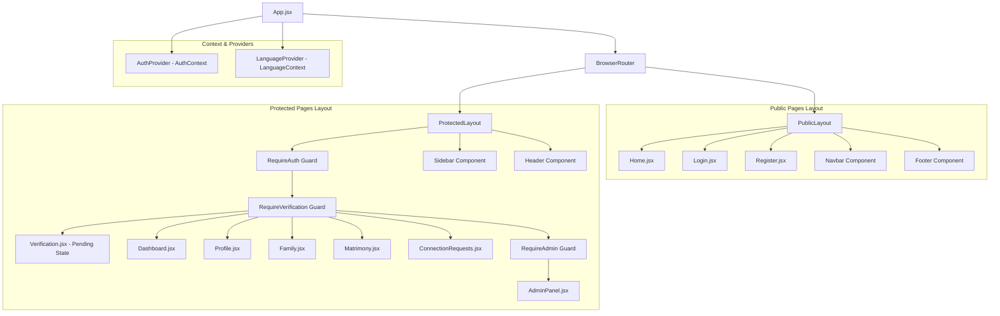

# Frontend Technical Specifications Document

**Project:** Community Registry & Matrimonial Platform (CommunityConnect)  
**Version:** 1.0 (MVP Scope)  
**Tech Stack:** React 19, Vite 8, TailwindCSS v4, React Router v6+  
**Status:** Completed Draft  

---

## 1. Architecture Overview

The CommunityConnect frontend is structured as a single-page application (SPA) built on React 19. It uses context-based auth management, React Query (TanStack Query) for remote data fetching/caching, route-based code splitting, and strict role/status guards to enforce privacy tiers.

### 1.1 Component Tree & Hierarchy

The following Mermaid diagram maps the high-level application component structure, showing context boundaries, public vs. protected layout wrappers, and page routing destinations.



---

## 2. Project Structure

The project directory structure follows a modular, feature-oriented pattern designed for scalability up to 50k users. Files under `frontend/src/` are organized as follows:

```
frontend/src/
├── api/
│   ├── client.js              # Axios configuration, interceptors, and base configs
│   ├── auth.js                # Authentication endpoints (OTP request, verification)
│   ├── registry.js            # Profiles, search, family, and memorial operations
│   ├── verification.js        # Admin actions, verification status, and logs
│   └── matrimony.js           # Matches, connection requests, and options
├── assets/
│   ├── images/                # Branding assets, fallback profile avatars
│   └── icons/                 # Custom SVG icons and resources
├── components/
│   ├── common/
│   │   ├── Button.jsx         # Accessible button with loading/variant options
│   │   ├── Card.jsx           # Tailwind v4 card with glassmorphism utility
│   │   ├── Input.jsx          # Validation-aware form text inputs
│   │   ├── Badge.jsx          # Status pill (verified, minor, pending, memorial)
│   │   ├── Modal.jsx          # Accessible dialog with focus trapping
│   │   └── Spinner.jsx        # Loading indicator skeleton & spinning icons
│   ├── layout/
│   │   ├── Navbar.jsx         # Public header bar
│   │   ├── Sidebar.jsx        # Responsive navigation sidebar for dashboard
│   │   ├── Header.jsx         # Inner dashboard bar with profile dropdown
│   │   ├── Footer.jsx         # Site footer
│   │   ├── PublicLayout.jsx   # Layout routing outlet for public pages
│   │   └── ProtectedLayout.jsx# Layout routing outlet with guards for authenticated pages
│   ├── profile/
│   │   ├── ProfileCard.jsx    # Registry list profile preview
│   │   └── ProfileForm.jsx    # Multi-step profile editing component
│   ├── family/
│   │   ├── FamilyMemberCard.js# Details of family units
│   │   └── AddMinorModal.jsx  # Parental form to add minor accounts
│   ├── matrimony/
│   │   ├── MatchCard.jsx      # Matrimony profile display (private vs open fields)
│   │   └── PrefsForm.jsx      # Matrimony opt-in, co-approver toggle settings
│   └── admin/
│       ├── RequestRow.jsx     # Row for verification requests table
│       └── CompareModal.jsx   # Side-by-side local verification data compare
├── context/
│   ├── AuthContext.jsx        # Keeps session tokens, auth state, and decoded roles
│   └── LanguageContext.jsx    # Handles English/Kannada dictionaries & switching
├── hooks/
│   ├── useAuth.js             # Syntactic sugar hook for AuthContext
│   ├── useLanguage.js         # Syntactic sugar hook for LanguageContext
│   ├── useForm.js             # Minimal custom form validation/handlers helper
├── pages/
│   ├── Home.jsx               # Landing page with Trust backing information
│   ├── Login.jsx              # Email entry & OTP flow
│   ├── Register.jsx           # Initial profile registration form
│   ├── Dashboard.jsx          # User overview screen (family, status, alerts)
│   ├── Profile.jsx            # Detailed view and self-management area
│   ├── Family.jsx             # Family units view, minor listings
│   ├── Verification.jsx       # Verification progress timeline
│   ├── Matrimony.jsx          # Opt-in matrimonial search engine
│   ├── ConnectionRequests.jsx # Received & sent matchmaking requests manager
│   ├── AdminPanel.jsx         # Admin verification queues, tie-breaks, audit trails
│   └── NotFound.jsx           # 404 fallback page
├── utils/
│   ├── constants.js           # API urls, routes, validation limits
│   └── helpers.js             # Date filters, localization storage, token helpers
├── App.jsx                    # Routing table configuration and layout assembly
├── index.css                  # Tailwinds v4 configuration, theme, base classes
└── main.jsx                   # Entry mount point
```

---

## 3. Routing Plan

The application implements client-side routing via React Router v6+. Routes are categorized into Public, Unverified Protected, and Fully Verified Protected lists.

### 3.1 Route Configuration Table

| Path | Layout | Route Guard | Purpose | Target User Roles |
|---|---|---|---|---|
| `/` | `PublicLayout` | None | Landing, trust backing metadata | Unauthenticated visitors |
| `/login` | `PublicLayout` | None | OTP verification interface | Unauthenticated visitors |
| `/register` | `PublicLayout` | `RequireAuth` only | Initial profile registration | Authenticated users without profiles |
| `/verification-pending` | `ProtectedLayout` | `RequireAuth` | Verification progress tracker page | Authenticated, unverified users |
| `/dashboard` | `ProtectedLayout` | `RequireVerification` | Member home, alerts, dashboard | Verified adults, Family Heads |
| `/profile/:id?` | `ProtectedLayout` | `RequireVerification` | View/Edit a member profile | Verified users, Admins |
| `/family` | `ProtectedLayout` | `RequireVerification` | Manage family unit & minors | Verified users, Family Heads |
| `/matrimony` | `ProtectedLayout` | `RequireVerification` | Opt-in matrimonial list search | Verified unmarried adult users |
| `/connections` | `ProtectedLayout` | `RequireVerification` | Manage match request approvals | Verified unmarried adult users |
| `/admin` | `ProtectedLayout` | `RequireAdmin` | Pending queues, regions, logs | Local Admins, Community Admins |
| `*` | None | None | 404 Catch-All Page | All users |

### 3.2 Guard Route Implementations

#### 3.2.1 RequireAuth Guard
Protects routes from anonymous users. Redirects to `/login` if no JWT is stored in state/memory.
```jsx
// src/components/layout/RequireAuth.jsx
import { Navigate, useLocation } from 'react-router-dom';
import { useAuth } from '../../hooks/useAuth';

export default function RequireAuth({ children }) {
  const { user, isLoading } = useAuth();
  const location = useLocation();

  if (isLoading) return <div>Loading account details...</div>;

  return user ? children : <Navigate to="/login" state={{ from: location }} replace />;
}
```

#### 3.2.2 RequireVerification Guard
Ensures authenticated users have finished verification. If the profile status is `PENDING` or `UNVERIFIED`, they are redirected to `/verification-pending`.
```jsx
// src/components/layout/RequireVerification.jsx
import { Navigate } from 'react-router-dom';
import { useAuth } from '../../hooks/useAuth';

export default function RequireVerification({ children }) {
  const { user } = useAuth();

  if (!user.isProfileComplete) {
    return <Navigate to="/register" replace />;
  }

  if (!user.isVerified) {
    return <Navigate to="/verification-pending" replace />;
  }

  return children;
}
```

#### 3.2.3 RequireAdmin Guard
Blocks normal users from seeing administrative routing.
```jsx
// src/components/layout/RequireAdmin.jsx
import { Navigate } from 'react-router-dom';
import { useAuth } from '../../hooks/useAuth';

export default function RequireAdmin({ children }) {
  const { user } = useAuth();
  const isAdmin = user?.role === 'ADMIN' || user?.role === 'LOCAL_ADMIN';

  return isAdmin ? children : <Navigate to="/dashboard" replace />;
}
```

---

## 4. State Management Approach

State management relies on native React Contexts for global states (Auth, Language), custom hooks, and **React Query** for server-state caching, fetching, and pagination. This eliminates extra boilerplate while providing excellent UX with background refetching and prefetching (e.g. prefetching matrimony profile stacks).

### 4.1 AuthContext Schema

Stores active credentials, decodes JWT payloads, and controls expiration checks.

```javascript
// AuthContext schema structure
{
  user: {
    id: string,
    phone: string,
    role: 'ADMIN' | 'LOCAL_ADMIN' | 'FAMILY_HEAD' | 'SELF' | 'MINOR' | 'UNVERIFIED',
    isVerified: boolean,
    isProfileComplete: boolean,
    matrimonyOptedIn: boolean,
    name: string
  } | null,
  token: string | null,
  isLoading: boolean,
  login: (phone: string, otp: string) => Promise<void>,
  logout: () => void,
  updateUserField: (key: string, value: any) => void
}
```

### 4.2 LanguageContext Schema

Maintains localization settings and translates texts using static dictionaries.

```javascript
// LanguageContext schema structure
{
  locale: 'en' | 'kn',
  setLocale: (lang: 'en' | 'kn') => void,
  t: (key: string) => string
}
```

### 4.3 Context Optimization

To minimize unnecessary re-renders across the component tree:
1. **Value Memoization:** Context providers use `useMemo` for their state objects to prevent re-rendering child branches on parent state fluctuations.
2. **Coarse-to-Fine Structure:** Global contexts are limited to `AuthContext` and `LanguageContext`. Module-specific states (e.g., search filters, active admin tables) are managed locally within their respective page trees.

---

## 5. Authentication Flow

Authentication uses Email OTP tokens. JWTs are returned after validation and managed securely in the browser.

```
[ User Email Entry ] ──(Submit Email)──> [ POST /auth/register/email ]
                                                    │
                                           (Backend Sends Email)
                                                    │
                                                    ▼
[ 6-Digit OTP Screen ] <─(Enter OTP)─── [ Verify Code & Session ]
         │
    (Submit OTP)
         │
         ▼
[ POST /auth/verify/email ] ───────> [ Returns JWT & Profile Status ]
                                                    │
                                           (Store JWT in Storage)
                                                    │
                                                    ▼
                                    [ Redirect Guard Engine ]
                                     ├── isProfileComplete = false ──> /register
                                     ├── isVerified = false        ──> /verification-pending
                                     └── isVerified = true         ──> /dashboard
```

### 5.1 Step-by-Step UI Transitions

1. **Step 1: Email Input UI:**
   - Input field with standard email format validation.
   - "Send OTP" button contains throttle controls (disabled for 60 seconds after execution).

2. **Step 2: OTP Verification UI:**
   - Screen locks and focuses on a 6-field single-character input box structure.
   - Clipboard integration automatically splits and populates the fields on paste.
   - Count-down timer shows seconds remaining until user can request resending.

3. **Step 3: Client Token Storage:**
   - JWT tokens are saved in `localStorage` for cross-tab persistence. 
   - An interceptor in `src/api/client.js` automatically appends the token in the request header:
     `Authorization: Bearer <token>`
   - Interceptor responds to 401 Unauthorized responses by clearing stored keys and forcing a routing redirect to `/login`.

---

## 6. Key Page Designs & Components

### 6.1 Home Page (`Home.jsx`)
- **Purpose:** Serve as the platform's public storefront. Establish official legitimacy via details of the Community Trust.
- **Key Components:**
  - `HeroSection`: Header taglines, stats summary, and quick links.
  - `TrustCredentials`: Displays community head messages, official seal images, and trust committee signatures.
  - `FeatureGrid`: Visual cards describing the Registry, Matrimony, and Privacy features.
- **UI/UX & Layout:** Full-width container with gradient backdrops. Mobile layouts stack content vertically, while desktop views display a three-column card grid. Interactive buttons use hover scale animations.

### 6.2 Login Page (`Login.jsx`)
- **Purpose:** Securely log members in or create accounts using OTPs.
- **Key Components:**
  - `PhoneForm`: Core input, validations, and SMS send triggers.
  - `OtpForm`: Interactive digit boxes and a resend timer.
- **UI/UX & Layout:** Centered single-column layout using glassmorphism styling. Designed for simple one-handed tapping on mobile.

### 6.3 Registration Page (`Register.jsx`)
- **Purpose:** Enable new users to complete their profile registration.
- **Key Components:**
  - `OnboardingProgress`: Stepper indicator tracking progress from 0% to 100%.
  - `PersonalSection`: Input fields for full name, DOB, and gender selection.
  - `AddressSection`: Text fields for address and contact details.
  - `FamilyLinkage`: Dropdown search component to link the user's profile to an existing verified family group (with an option for "No Family/Orphan" to route verification requests directly to admins).
- **UI/UX & Layout:** Card-wrapped multi-step layout. Transitions between sections use horizontal sliding animations. Form fields show real-time inline validations.

### 6.4 Dashboard Page (`Dashboard.jsx`)
- **Purpose:** Provide members with a home base for notifications, family updates, and quick navigation.
- **Key Components:**
  - `VerificationBanner`: Alert displaying verification status.
  - `FamilySummaryCard`: List of family members with quick-action profile links.
  - `QuickActionsGrid`: Navigation buttons to update profile, open matrimonial search, or view family details.
- **UI/UX & Layout:** Responsive dashboard sidebar layout. The sidebar collapses into a slide-over drawer menu on mobile displays.

### 6.5 Profile Page (`Profile.jsx`)
- **Purpose:** Display and edit profile details, toggle privacy settings, and display memorial banners.
- **Key Components:**
  - `VisibilityToggle`: Icons next to fields showing visibility settings (e.g. eye icon for public details, lock icon for restricted details).
  - `MemorialBanner`: Displays a black/gray memorial ribbon on profiles marked as deceased. This disables all editing except by Community Admins.
  - `EditProfileForm`: Standard fields wrapper with validation rules.
- **UI/UX & Layout:** Two-column grid layout on desktop screens. Left column shows profile photo, status tags, and visibility settings. Right column shows the edit form inputs.

### 6.6 Family Page (`Family.jsx`)
- **Purpose:** Display family unit members and manage minor profiles.
- **Key Components:**
  - `FamilyMemberList`: List of profile cards showing family members.
  - `AddMinorModal`: Simple form for adding a child's profile.
- **UI/UX & Layout:** Flexible grid displaying family cards. Shows "View Only" badges next to minors and dual-ownership details for members who have turned 18.

### 6.7 Verification Page (`Verification.jsx`)
- **Purpose:** Let unverified users track their verification status.
- **Key Components:**
  - `StatusTimeline`: Vertical timeline component indicating verification progress (e.g., Local Admin approval state, Community Head tie-break status).
  - `ContactSupportCard`: Direct contact information for local support staff.
- **UI/UX & Layout:** Clean centered column layout. Completed steps on the timeline are highlighted in emerald, pending steps in indigo, and issues in amber.

### 6.8 Matrimony Page (`Matrimony.jsx`)
- **Purpose:** Search and filter matches. Swipe through match stack. Enable or disable matrimonial visibility. Guardians can recommend profiles.
- **Key Components:**
  - `OptInControl`: Matrimonial module visibility toggle.
  - `SwipeStack`: Tinder-like card swiper for matching, with keyboard support and React Query prefetching (fetches next 10 items).
  - `GuardianView`: A dedicated tab showing wards and a list of profiles recommended to the ward by the guardian.
  - `MatchGrid`: Grid of member cards. Unconnected profiles show only registry-compliant basic details (photo, name, age).
- **UI/UX & Layout:** Three-column view or Card Stack. Left: sticky search/filter panel; Right: grid of matching profiles or swiper UI. Mobile views add a sliding filter drawer. Pinned guardian recommendations are visible.

### 6.9 Connection Requests Page (`ConnectionRequests.jsx`)
- **Purpose:** Manage matchmaking connection requests.
- **Key Components:**
  - `RequestTabs`: Switch between "Sent" and "Received" lists.
  - `RequestStatusCard`: Displays request status, co-approver requirements, and action buttons (Approve, Reject, Cancel).
- **UI/UX & Layout:** Clean tabbed list layout. Displays clear warning badges if a request is waiting for a family co-approver's decision.

### 6.10 Admin Panel Page (`AdminPanel.jsx`)
- **Purpose:** Admin queue management and verification processing.
- **Key Components:**
  - `RegionFilter`: Filter requests by regional district.
  - `ApprovalTable`: Lists pending verifications and details.
  - `AuditTrailViewer`: Filterable event log tracking admin decisions.
- **UI/UX & Layout:** Wide-screen layout. Large tables scroll horizontally on small screens. Row clicks open comparison details in a popup modal.

---

## 7. Component Library & TailwindCSS v4 Setup

TailwindCSS v4 uses a CSS-first configuration. Customized variables and values are added directly inside `src/index.css` using the `@theme` directive.

### 7.1 Custom CSS Configurations (`src/index.css`)

```css
@import "tailwindcss";

@theme {
  /* Brand Color Palette */
  --color-primary-50: #eef2ff;
  --color-primary-100: #e0e7ff;
  --color-primary-200: #c7d2fe;
  --color-primary-300: #a5b4fc;
  --color-primary-400: #818cf8;
  --color-primary-500: #6366f1;
  --color-primary-600: #4f46e5;
  --color-primary-700: #4338ca;
  --color-primary-800: #3730a3;
  --color-primary-900: #312e81;
  --color-primary-950: #1e1b4b;

  --color-accent-50: #ecfdf5;
  --color-accent-100: #d1fae5;
  --color-accent-200: #a7f3d0;
  --color-accent-300: #6ee7b7;
  --color-accent-400: #34d399;
  --color-accent-500: #10b981;
  --color-accent-600: #059669;
  --color-accent-700: #047857;
  --color-accent-800: #065f46;
  --color-accent-900: #064e3b;

  --color-surface-50: #f8fafc;
  --color-surface-100: #f1f5f9;
  --color-surface-200: #e2e8f0;
  --color-surface-300: #cbd5e1;
  --color-surface-400: #94a3b8;
  --color-surface-500: #64748b;
  --color-surface-600: #475569;
  --color-surface-700: #334155;
  --color-surface-800: #1e293b;
  --color-surface-900: #0f172a;
  --color-surface-950: #020617;

  /* Typography Fonts */
  --font-sans: 'Inter', system-ui, -apple-system, sans-serif;
  --font-heading: 'Outfit', system-ui, sans-serif;

  /* Custom Border Radius */
  --radius-4xl: 2rem;

  /* Keyframe Animations */
  --animate-fade-in: fadeIn 0.4s cubic-bezier(0.16, 1, 0.3, 1);
  --animate-slide-up: slideUp 0.4s cubic-bezier(0.16, 1, 0.3, 1);
  --animate-scale-in: scaleIn 0.25s cubic-bezier(0.16, 1, 0.3, 1);
}

@keyframes fadeIn {
  0% { opacity: 0; }
  100% { opacity: 1; }
}

@keyframes slideUp {
  0% { opacity: 0; transform: translateY(16px); }
  100% { opacity: 1; transform: translateY(0); }
}

@keyframes scaleIn {
  0% { opacity: 0; transform: scale(0.96); }
  100% { opacity: 1; transform: scale(1); }
}
```

### 7.2 Reusable Design Tokens

CSS classes are defined inside `src/index.css` to keep UI components consistent.

```css
/* Custom Utility Components */

/* Buttons */
.btn-primary {
  display: inline-flex;
  align-items: center;
  justify-content: center;
  gap: 0.5rem;
  padding: 0.75rem 1.5rem;
  border-radius: 0.75rem;
  background: linear-gradient(to right, var(--color-primary-600), var(--color-primary-500));
  color: #ffffff;
  font-weight: 600;
  font-size: 0.875rem;
  box-shadow: 0 10px 15px -3px rgba(99, 102, 241, 0.25);
  transition: all 0.2s cubic-bezier(0.16, 1, 0.3, 1);
  cursor: pointer;
  border: none;
}
.btn-primary:hover {
  background: linear-gradient(to right, var(--color-primary-500), var(--color-primary-400));
  box-shadow: 0 20px 25px -5px rgba(99, 102, 241, 0.35);
  transform: translateY(-1px);
}
.btn-primary:active {
  transform: translateY(0) scale(0.98);
}

.btn-secondary {
  display: inline-flex;
  align-items: center;
  justify-content: center;
  gap: 0.5rem;
  padding: 0.75rem 1.5rem;
  border-radius: 0.75rem;
  background: var(--color-surface-100);
  color: var(--color-surface-700);
  font-weight: 600;
  font-size: 0.875rem;
  border: 1px solid var(--color-surface-200);
  transition: all 0.2s cubic-bezier(0.16, 1, 0.3, 1);
  cursor: pointer;
}
.btn-secondary:hover {
  background: var(--color-surface-200);
  border-color: var(--color-surface-300);
}

/* Glass Cards */
.glass-card {
  background: rgba(255, 255, 255, 0.75);
  backdrop-filter: blur(20px);
  -webkit-backdrop-filter: blur(20px);
  border: 1px solid rgba(255, 255, 255, 0.3);
  border-radius: 1.25rem;
  box-shadow: 0 10px 25px -5px rgba(0, 0, 0, 0.05), 0 8px 10px -6px rgba(0, 0, 0, 0.05);
}

/* Form Input Elements */
.input-field {
  width: 100%;
  padding: 0.75rem 1rem;
  border-radius: 0.75rem;
  background: var(--color-surface-50);
  border: 1px solid var(--color-surface-200);
  color: var(--color-surface-900);
  font-size: 0.875rem;
  transition: all 0.2s;
}
.input-field:focus {
  outline: none;
  border-color: var(--color-primary-500);
  box-shadow: 0 0 0 3px rgba(99, 102, 241, 0.15);
}
```

---

## 8. Responsive Design Strategy

The responsive design system uses fluid layouts that adapt automatically to desktop, tablet, and mobile devices.

### 8.1 Layout Rules

- **Mobile First Approach:** Component classes target mobile screens by default (e.g. `grid-cols-1`). Media queries then expand columns for wider viewports (`sm:grid-cols-2 lg:grid-cols-3`).
- **Flexible Spacing:** Margins and paddings scale dynamically using relative layout classes (`px-4 sm:px-6 lg:px-8`).
- **Responsive Navigation:** The main application panel uses a toggleable sidebar system:
  - **Large Viewports (>=1024px):** Fixed navigation sidebar on the left side of the screen.
  - **Medium/Small Viewports (<1024px):** Navigation moves to a bottom utility bar or collapsible overlay drawer.

### 8.2 Touch Target Standards

- **Sizing:** Tap target sizes are kept to a minimum height/width of `48px` to ensure usability on mobile touchscreens.
- **Margins:** Active items like form buttons and links are separated by a minimum of `8px` of space to prevent accidental taps.

---

## 9. Accessibility & Localization

### 9.1 Localization Engine

Localization support for English and Kannada is managed through `LanguageContext`. Dict files map translatable strings to unique keys:

```json
// src/utils/locales/en.json
{
  "nav": {
    "dashboard": "Dashboard",
    "registry": "Registry",
    "matrimony": "Matrimony"
  },
  "status": {
    "verified": "Verified Member",
    "unverified": "Pending Verification",
    "memorial": "Memorial Record"
  }
}

// src/utils/locales/kn.json
{
  "nav": {
    "dashboard": "ಡ್ಯಾಶ್ಬೋರ್ಡ್",
    "registry": "ನೋಂದಣಿ ಪುಸ್ತಕ",
    "matrimony": "ವರಾನ್ವೇಷಣೆ"
  },
  "status": {
    "verified": "ದೃಢೀಕೃತ ಸದಸ್ಯ",
    "unverified": "ಪರಿಶೀಲನೆ ಬಾಕಿ ಇದೆ",
    "memorial": "ಸ್ಮರಣಾರ್ಥ ದಾಖಲೆ"
  }
}
```

Translation hook usage in UI components:
```jsx
import { useLanguage } from '../hooks/useLanguage';

export function StatusBadge({ status }) {
  const { t } = useLanguage();
  return (
    <span className="badge">
      {status === 'VERIFIED' ? t('status.verified') : t('status.unverified')}
    </span>
  );
}
```

### 9.2 Accessibility Practices (a11y)

- **Semantic Layouts:** The code uses semantic HTML5 tags (e.g. `<header>`, `<nav>`, `<main>`, `<section>`).
- **Keyboard Control:** Interactive components (like Modals and Dropdowns) support standard keyboard shortcuts. Modals trap keyboard focus inside their container when open.
- **Screen Reader Support:** UI controls without visible labels (such as search boxes or image buttons) include explicit `aria-label` tags.

---

## 10. Performance Optimization

### 10.1 Code Splitting & Lazy Loading

Pages are loaded dynamically as the user navigates. This reduces the initial bundle size and speeds up load times.

```jsx
// src/App.jsx
import React, { Suspense, lazy } from 'react';
import { BrowserRouter, Routes, Route } from 'react-router-dom';
import LoadingScreen from './components/common/LoadingScreen';

// Lazy load route destinations
const Dashboard = lazy(() => import('./pages/Dashboard'));
const Profile = lazy(() => import('./pages/Profile'));
const Family = lazy(() => import('./pages/Family'));
const Matrimony = lazy(() => import('./pages/Matrimony'));
const AdminPanel = lazy(() => import('./pages/AdminPanel'));

export default function App() {
  return (
    <BrowserRouter>
      <Suspense fallback={<LoadingScreen />}>
        <Routes>
          <Route path="/dashboard" element={<Dashboard />} />
          <Route path="/profile" element={<Profile />} />
          <Route path="/family" element={<Family />} />
          <Route path="/matrimony" element={<Matrimony />} />
          <Route path="/admin" element={<AdminPanel />} />
        </Routes>
      </Suspense>
    </BrowserRouter>
  );
}
```

### 10.2 Asset and List Optimization

- **Image Management:** Profile images are compressed and served in WebP format. Standard icons are loaded as inline SVG elements to reduce HTTP requests.
- **On-Scroll Infinite Pagination:** Dense admin queues, regional scopes, and matching feeds utilize TanStack Query's `useInfiniteQuery` coupled with the browser's `IntersectionObserver` API to lazily request and append paginated page blocks as the user scrolls, minimizing redundant network requests and rendering latency.
- **Rendering Optimization:** Complex listings and lists (such as the Matrimony matching queue or registry index page) use virtualization techniques to render only the visible cards on the screen.

---

## 11. Error & Loading States

### 11.1 Global Error Boundaries

The application uses Error Boundaries to catch Javascript runtime errors and display a fallback UI instead of crashing the app.

```jsx
// src/components/common/ErrorBoundary.jsx
import React from 'react';

export class ErrorBoundary extends React.Component {
  constructor(props) {
    super(props);
    this.state = { hasError: false };
  }

  static getDerivedStateFromError() {
    return { hasError: true };
  }

  componentDidCatch(error, errorInfo) {
    console.error("ErrorBoundary caught error: ", error, errorInfo);
  }

  render() {
    if (this.state.hasError) {
      return (
        <div className="flex flex-col items-center justify-center min-h-screen p-6 bg-surface-50 text-center">
          <h2 className="text-2xl font-bold mb-4">Something went wrong</h2>
          <p className="text-surface-500 mb-6">We encountered an unexpected layout crash. Please try reloading the page.</p>
          <button className="btn-primary" onClick={() => window.location.reload()}>
            Reload Application
          </button>
        </div>
      );
    }
    return this.props.children;
  }
}
```

### 11.2 Loading States (Skeleton Screens)

To make loading transitions feel smoother, components display content skeletons that match the shape of the page data.

```jsx
// src/components/common/SkeletonCard.jsx
export default function SkeletonCard() {
  return (
    <div className="glass-card p-6 animate-pulse">
      <div className="flex items-center gap-4 mb-4">
        <div className="w-12 h-12 rounded-full bg-surface-200" />
        <div className="flex-1">
          <div className="h-4 bg-surface-200 rounded w-1/3 mb-2" />
          <div className="h-3 bg-surface-200 rounded w-1/4" />
        </div>
      </div>
      <div className="h-3 bg-surface-200 rounded w-full mb-2" />
      <div className="h-3 bg-surface-200 rounded w-2/3" />
    </div>
  );
}
```

### 11.3 Toast Notifications

The application uses an asynchronous notification system to alert users of API changes, validation warnings, or action updates.

- **Types:** Info (indigo), Success (emerald), Warning (amber), Danger (rose).
- **Positioning:** Floating container pinned to the top-right of the screen on desktop, and bottom-center on mobile. Alerts auto-dismiss after 4 seconds.
