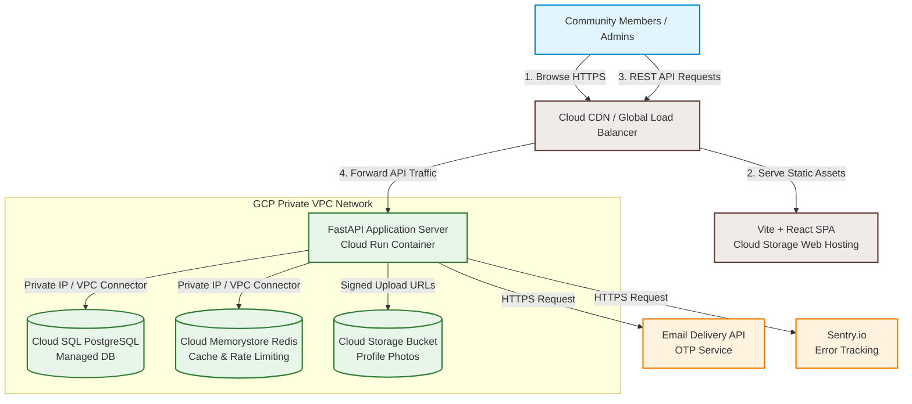
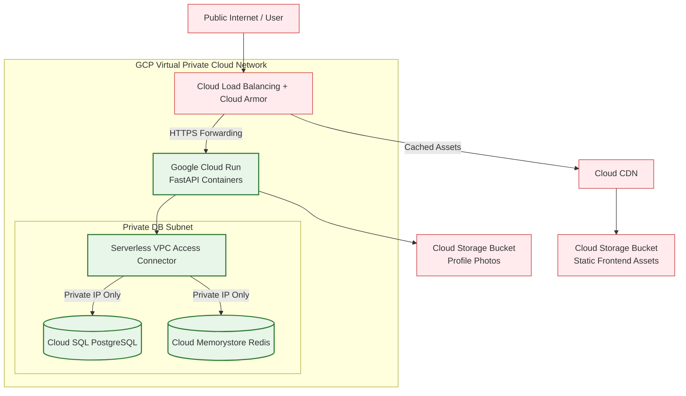
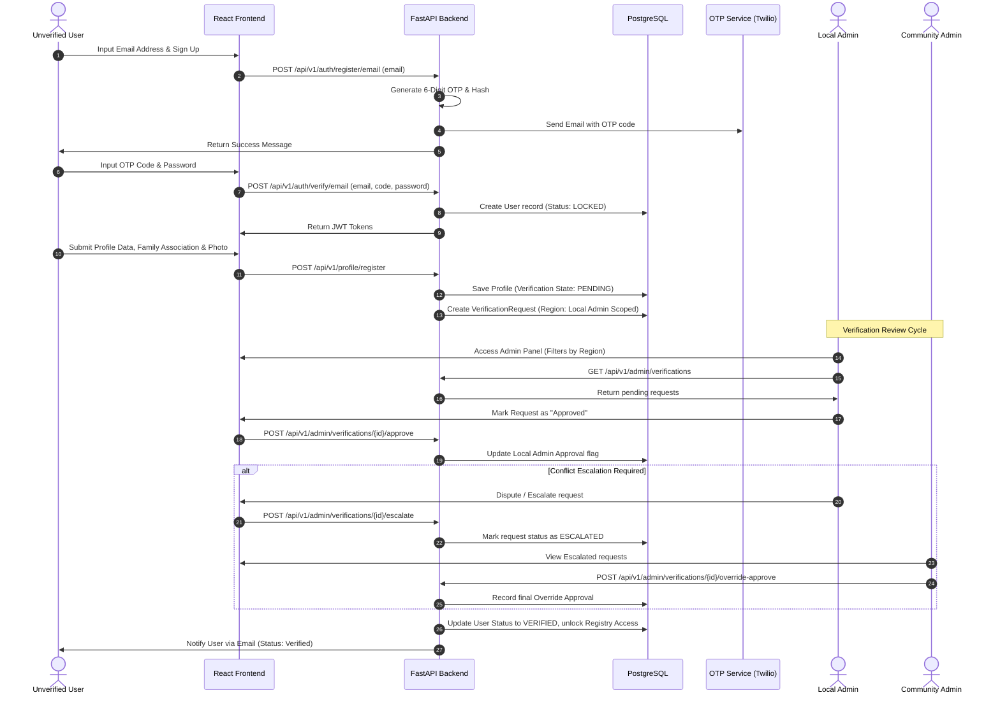
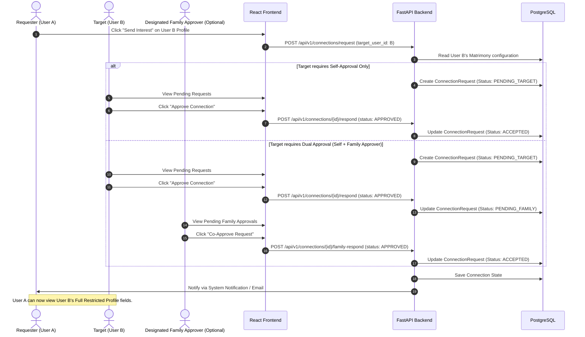
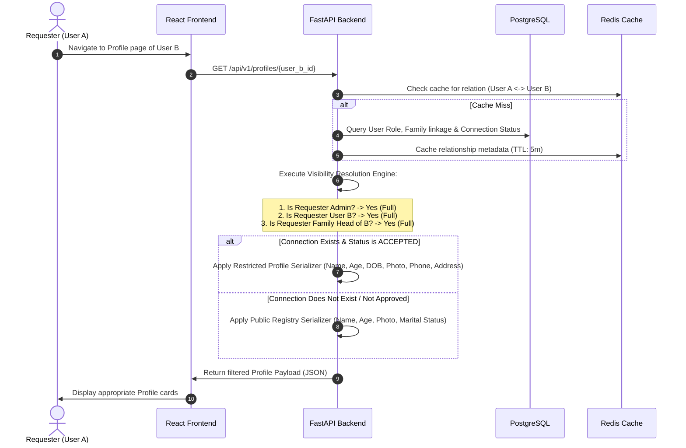
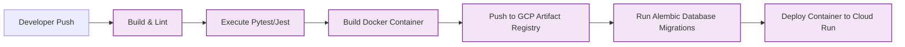

# System Architecture Document
## Community Registry & Matrimonial Platform

This document defines the comprehensive technical architecture, security designs, data flows, infrastructure setup, and operational guidelines for the **Community Registry & Matrimonial Platform**. It serves as the primary technical specification for development, deployment, and security auditing.

---

## 1. High-Level System Architecture

The application follows a modern, decoupled, multi-tier architecture designed for security, scalability, and serverless deployment. All client interactions with the backend are secured via HTTPS and routed through a Global Load Balancer.



---

## 2. Technology Stack

The stack selection prioritizes rapid API development, strong static typing, security, and low operational overhead.

| Component | Technology | Version | Purpose |
| :--- | :--- | :--- | :--- |
| **Frontend Framework** | React | `18.3.x` | Core client-side Single Page Application (SPA) framework. |
| **Frontend Builder** | Vite | `5.x` | Modern, ultra-fast toolchain for local development and build bundling. |
| **Frontend State** | TanStack Query (React Query) | `5.x` | Server state management, auto-caching, and declarative queries/mutations. |
| **Frontend Router** | React Router | `6.x` | Client-side routing with route guards (e.g., Unverified vs. Verified). |
| **Styling** | Vanilla CSS / CSS Modules | Standard | Structured styling using CSS Custom Properties for dynamic theme support. |
| **Language** | TypeScript / Python | `5.x` / `3.11+` | End-to-end type safety on both frontend components and backend logic. |
| **Backend Framework** | FastAPI | `0.111.x` | High-performance asynchronous API framework with automatic OpenAPI docs. |
| **ASGI Server** | Uvicorn | `0.30.x` | Lightning-fast ASGI web server implementation. |
| **ORM** | SQLAlchemy | `2.0.x` | Modern Object-Relational Mapper utilizing asynchronous connection pooling. |
| **Migrations** | Alembic | `1.13.x` | Lightweight database migration tool for PostgreSQL. |
| **Database** | PostgreSQL | `15` / `16` | Relational database engine for ACID compliance and structured JSON querying. |
| **Cache & Queue** | Redis (Memorystore) | `7.x` | Token revocation, active session storage, and rate limiter. |
| **Validation** | Pydantic | `2.7.x` | Data validation, sterilization, and serialization on incoming requests. |
| **Authentication** | PyJWT | `2.8.x` | JSON Web Token encoding/decoding for secure authentication. |
| **Image Handler** | Pillow / Libjpeg | `10.x` | Server-side image resizing, metadata stripping, and compression. |

---

## 3. Infrastructure Architecture

The platform is hosted on **Google Cloud Platform (GCP)**, utilizing serverless components to minimize baseline operational costs while ensuring seamless scale-up during peak usage.



### 3.1 Network Topology & Cloud SQL Access
* **VPC Network**: A single Virtual Private Cloud (VPC) with a dedicated subnetwork for database services.
* **Serverless VPC Access Connector**: Used to bridge serverless Cloud Run instances to the VPC network. Cloud Run has no public interface inside the database subnet; communication occurs via private IPs (`10.x.x.x`).
* **Cloud NAT & Cloud Router**: Configured so that Cloud Run instances can securely send outbound HTTPS requests (e.g., to Email APIs and Sentry) without exposing public IP addresses.
* **Database Isolation**: The Cloud SQL instance is configured with **Private IP only**. All public access paths are disabled.

### 3.2 Compute (Cloud Run)
* FastAPI containerized using a multi-stage Dockerfile based on `python:3.11-slim`.
* Minimum instances: `0` (scales down to zero when idle to save cost) in Dev/Staging, and `1` in Production (to prevent cold-start delays).
* Max instances: `10` (highly sufficient for up to 50k users, throttled to prevent database connection exhaustion).
* CPU allocation: Allocates CPU only during request processing (`--no-cpu-throttling` is disabled for cost-efficiency, but can be enabled if WebSockets or background loops are required).

### 3.3 Storage System
* **Static Asset Bucket**: Hosts the production build of the React SPA. Configured as a public bucket backing Google Cloud CDN.
* **User Media Bucket (`communityconnect-user-photos`)**: Configured with **Uniform Bucket-Level Access (UBLA)**. 
  * Directly uploaded files undergo standard validation.
  * Public access is disabled on this bucket. Instead, the backend generates temporary, time-bound **GCS Signed URLs** (e.g., valid for 15 minutes) for clients to read photos, strictly respecting Visibility Tier permissions.

---

## 4. Security Architecture

### 4.1 OTP Verification Flow
The platform relies on passwordless, verification-first OTP entry.
1. **Request**: The user enters their phone number (`+91XXXXXXXXXX`).
2. **Generation**: The backend generates a cryptographically secure 6-digit numeric code.
3. **Storage**: The hash of the OTP, along with request metadata (retry count, expiration timestamp set to `now + 10 minutes`), is stored in Redis (or PostgreSQL).
4. **Rate Limiting**: To prevent email flooding, an email address is restricted to:
   * Max 1 OTP request per 2 minutes.
   * Max 3 OTP requests per 1 hour.
5. **Cooldown**: Exceeding the limits locks the email address for 15 minutes.

### 4.2 JWT Authentication Model
Upon successful OTP validation, the backend generates a secure token pair:
* **Access Token**:
  * Type: JWT (signed with HMAC-SHA256).
  * Expiration: 15 minutes.
  * Contents: `sub` (User UUID), `role` (e.g., `SELF`), `verified` (bool).
  * Storage: Sent via JSON response body; client stores this in memory.
* **Refresh Token**:
  * Expiration: 7 days.
  * Storage: Returned in an `HttpOnly`, `Secure`, `SameSite=Strict` cookie to mitigate Cross-Site Scripting (XSS) risks.
  * Revocation: On logout, the token is added to a Redis blocklist for the remainder of its lifespan.

### 4.3 Role-Based Access Control (RBAC)
FastAPI dependency injection enforces role requirements at the route level.

```python
# Conceptual Backend Access Check
async def get_current_verified_user(user: User = Depends(get_current_user)):
    if not user.is_verified:
        raise HTTPException(status_code=403, detail="Account is pending verification.")
    return user

async def require_role(allowed_roles: List[UserRole]):
    async def dependency(user: User = Depends(get_current_verified_user)):
        if user.role not in allowed_roles:
            raise HTTPException(status_code=403, detail="Insufficient permission.")
        return user
    return dependency
```

### 4.4 Data Visibility Resolution Engine
Visibility permissions must be verified at the database query/serialization layer, rather than on the frontend. The backend applies a query filter engine based on the relationship between the `Requester` and the `Profile Owner`:

```
               [Requester Profile Request]
                           │
                           ▼
                 Is Requester Admin? ──────────────────────► [FULL ACCESS]
                           │ No
                           ▼
            Is Requester the Profile Owner? ───────────────► [FULL ACCESS]
                           │ No
                           ▼
          Is Requester Owner's Family Head? ───────────────► [FULL ACCESS]
                           │ No
                           ▼
          Is Profile Owner in "Memorial" State? ───────────► [READ-ONLY PUBLIC]
                           │ No
                           ▼
        Is Requester Verified Community Member? 
                           │ Yes
                           ├───────────────────────────────► [PUBLIC ACCESS]
                           │                                (Name, Age, Photo)
                           ▼
        Are they matched in Matrimony Module?
               (Mutual APPROVED Connection)
                           │ Yes
                           └───────────────────────────────► [RESTRICTED ACCESS]
                                                            (DOB, Contact, Address)
```

### 4.5 Data Encryption & Sanitization
* **In-Transit**: TLS 1.3 forced via Google Application Load Balancer. All HTTP requests are automatically redirected to HTTPS.
* **At-Rest (Database)**: Google Cloud SQL encrypts data on disk automatically.
* **At-Rest (Application-Level)**: Highly sensitive fields (e.g., exact Date of Birth, contact phone, home address) are encrypted using authenticated AES-GCM (via the Python `cryptography` library) before database insertion. The encryption key is retrieved at runtime from **GCP Secret Manager**.
* **Input Validation**: All incoming bodies are validated using Pydantic. Any HTML input is sanitized using `bleach` to prevent XSS.
* **CORS Policy**: Configured strictly in FastAPI using `CORSMiddleware`:
  * Allowed Origins: `https://communityconnect.org`, `https://staging.communityconnect.org`.
  * Credentials: Allowed (`True`) to support secure cookies.

---

## 5. System Data Flows

### 5.1 Registration & Verification Sequence
This flow outlines the multi-party verification process required to activate a new profile.



### 5.2 Connection Request Flow (Matrimonial Module)
This sequence illustrates the private-account request workflow, including the optional double-approval flow.



### 5.3 Visibility Resolution Flow
This sequence shows the runtime query filtering logic applied on every registry request.



---

## 6. Scalability Strategy

The system is designed to handle **10k to 50k users** without architectural modifications.

### 6.1 Database Optimization
* **Index Strategy**: Core indexes applied to foreign key lookups and highly queried fields:
  * Unique index on `users.phone_number`.
  * Index on `profiles.family_unit_id`.
  * Composite index on `connections(requester_id, target_id, status)`.
  * Index on `profiles.is_active` where `is_active = true` (partial indexing for active members, ignoring deactivated or deceased records).
* **Connection Pooling**:
  * FastAPI uses SQLAlchemy `AsyncSession` backed by an `AsyncConnectionPool`.
  * Pool configuration: `pool_size=20`, `max_overflow=10`, `pool_recycle=1800` (prevents database connection leakage).
  * Cloud SQL Config: Sized to support up to 500 concurrent connections. Read replicas can be dynamically spun up if read traffic dominates.

### 6.2 Caching Strategy (Redis)
* **API Metadata Caching**: User verification status and active registry metadata cached for 1 hour.
* **Session Cache**: Access token revocation lists (blacklists) stored in Redis with an expiration matching the token's TTL.
* **Database Offloading**: Matrimony matching settings and user relationships cached with a 5-minute TTL.

### 6.3 Media Handlers (Optimization & Costs)
* Clients do not upload images directly to the API container. Instead, the backend generates an authorized **GCS Signed Write URL**. The client uploads the raw photo directly to Cloud Storage.
* An asynchronous event triggers an image post-processor (or a Cloud Function) that:
  1. Compresses the photo using Pillow (maximum width 800px, quality 85%).
  2. Strips EXIF metadata (geo-location tags and camera information) for privacy protection.
  3. Re-saves the file as WebP.
  4. Deletes the raw upload.

---

## 7. Operations & Infrastructure Maintenance

### 7.1 Monitoring & Logging
* **Logging System**: FastAPI logs formatted in structured JSON using `structlog` and pushed directly to **GCP Cloud Logging**.
* **Audit Trail Requirements**:
  * Every verification approval/rejection must log the admin user ID, targeted profile ID, action, timestamp, and reasoning.
  * Profile modifications on behalf of minor accounts must log the parent/family head user ID.
* **Error Tracking**: Integration of Sentry SDK on both the React frontend and FastAPI backend, filtering out sensitive PII (emails, addresses) from stack traces.

### 7.2 Backup & Disaster Recovery (DR)
* **Recovery Objectives**:
  * **Recovery Point Objective (RPO)**: 1 Hour (Data loss limit).
  * **Recovery Time Objective (RTO)**: 4 Hours (Target restoration duration).
* **Cloud SQL Automated Backups**:
  * Daily scheduled backups with 30-day retention.
  * Point-in-Time Recovery (PITR) enabled, storing transaction logs to allow restoring the database state to any specific second within the last 7 days.
* **Storage Replication**: Cloud Storage buckets configured with Dual-Region availability (`asia-east1` and `asia-northeast1`) to survive a regional GCP outage.

### 7.3 CI/CD Deployment Pipeline
Automated pipeline implemented using GitHub Actions.



1. **Static Analysis**: Run `flake8` / `black` formatting checks on the backend, and `ESLint` / `TypeScript` compilers on the frontend.
2. **Test Automation**: Execute `pytest` suite for API endpoint logic and `Jest` mock suites for UI components.
3. **Artifact Creation**: Package the backend application into a Docker container, tag it with the commit SHA, and push to **GCP Artifact Registry**.
4. **Migration Execution**: Launch a transient Cloud Run Job to execute `alembic upgrade head` safely before code deployment.
5. **Zero-Downtime Deploy**: Perform a rolling update to Google Cloud Run, routing traffic to the new revision only after health checks successfully pass.

---

## 8. Deployment Environment Strategy

| Environment | Branch | Endpoint Domain | Purpose |
| :--- | :--- | :--- | :--- |
| **Development** | `develop` | Localhost (`127.0.0.1`) | Active codebase changes, developer sandboxing. |
| **Staging** | `release/*` | `https://staging.communityconnect.org` | Pre-production testing, QA validation, and Community Trust review. |
| **Production** | `main` | `https://communityconnect.org` | Stable live environment. |

* **Environment Isolation**: Staging and Production reside in completely separate GCP Projects (`communityconnect-staging` vs `communityconnect-production`) with distinct access credentials and billing controls to prevent cross-contamination.

---

## 9. Budget & Cost Estimation

Estimations are calculated for two milestones (10,000 users and 50,000 users) assuming hosting within **GCP Mumbai Region (`asia-south1`)**.

### 9.1 Cost Breakdown Table (Monthly)

| Service | GCP Configuration (MVP/10k Users) | Monthly Cost (10k) | GCP Configuration (Scale/50k Users) | Monthly Cost (50k) |
| :--- | :--- | :--- | :--- | :--- |
| **Cloud Run** | 1 instance, 1 vCPU, 2GB RAM. Throttling active when idle. | **$12.00** | 2-4 auto-scaling instances, 1 vCPU, 2GB RAM. | **$35.00** |
| **Cloud SQL** | `db-f1-micro` (Shared CPU, 0.6GB RAM), 10GB storage. | **$10.00** | `db-custom-1-3840` (1 vCPU, 3.75GB RAM), High Availability, 50GB storage. | **$95.00** |
| **Cloud Memorystore** | Basic Tier (1GB capacity). | **$16.00** | Standard HA Tier (1GB capacity, replicated). | **$32.00** |
| **Cloud Storage** | 20GB storage + network egress traffic. | **$3.00** | 120GB storage + network egress traffic. | **$12.00** |
| **Cloud CDN & Bandwidth** | 100GB egress + CDN Cache requests. | **$8.00** | 500GB egress + CDN Cache requests. | **$30.00** |
| **Email Delivery Services** | ~1.5 messages per user registration/login. (Resend/SendGrid). | **$5.00** | Scale login volumes (OTP verify optimizations). | **$15.00** |
| **Sentry / Monitoring** | Developer Free Tier. | **$0.00** | Team Tier (increased throughput limits). | **$29.00** |
| **Total Estimated Cost**| — | **$54.00 / month** | — | **$248.00 / month** |

---

## 10. Development & Branching Workflow

The project utilizes a strict **GitHub Flow** pattern adapted for structured releases.

```
       develop  ───────────────────────────────────● (Merge Feature) ──────────
                  \                               /
      feature/foo  ●───────● (Commits) ──────────/
                    \
        release/1.0  ───────────────────────────────● (Freeze Staging QA) ───
                                                     \
               main  ─────────────────────────────────● (Production Release) ──
```

### 10.1 Branch Lifecycles
* **`main`**: Mirror of production. Only receives merges from `release/*` branches or direct hotfix commits.
* **`develop`**: Active integration branch. All feature branches merge into `develop`.
* **`feature/*`**: Short-lived branches spawned by developers from `develop`.
* **`release/*`**: Created from `develop` when preparing for a milestone release. Deployed to Staging for final QA.
* **`hotfix/*`**: Spawned from `main` to address critical production issues; merged back to both `main` and `develop`.

### 10.2 Pull Request Constraints
1. **Linear History**: All merges into `develop` and `main` must occur via Pull Requests. Direct pushes to these branches are blocked.
2. **Checks**: PRs must pass lint checks, static analysis, and all automated unit tests prior to merge approval.
3. **Approval**: At least one peer review approval is required for all PRs.
4. **Traceability**: Squash merges are enforced for feature branches to keep the Git history clean.
